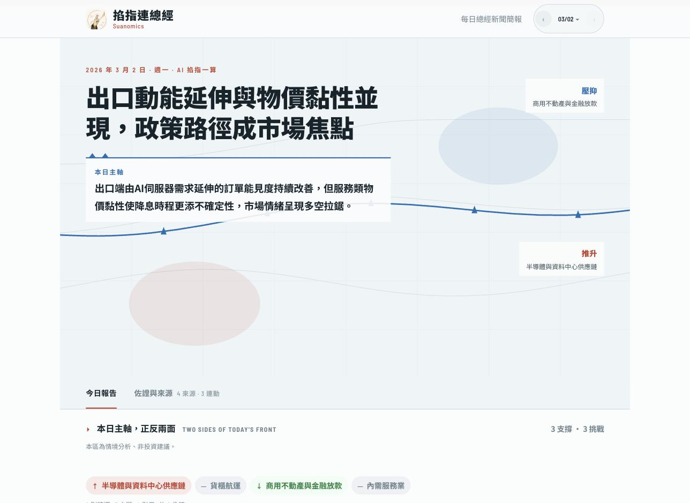

# Suanomics（掐指連總經）

每天台股開盤前，自動產出一份總經報告：昨晚世界上發生了什麼、可能怎麼影響今天的台股。

它跟「用 AI 摘要財經新聞」不一樣。摘要回答「發生了什麼」，這個系統要回答「所以會影響什麼、為什麼」——核心輸出是一串**連動鏈**，每條都長成「哪個產業、透過什麼機制、牽動哪些標的、往哪個方向」。一天產出幾十條，全部附引用來源。



上圖是讀者面的首屏。**畫面裡的內容是 repo 內建的合成範例**（虛構的公司、數字與新聞），不是真實市場分析；不用跑任何東西就能看一份完整報告長什麼樣：[範例報告 JSON](apps/server/tools/eval/fixtures/canary-example/2026-03-02/brief.json)（這組資料的說明見 [canary-example](apps/server/tools/eval/fixtures/canary-example/README.md)）。

> [!WARNING]
> **這不是投資工具，也不構成投資建議。**
>
> - 報告內容全部由 LLM 產生，可能有錯誤、過時或誤導性的推論。不要依此做投資決策。
> - 使用者需自行判斷並承擔所有使用後果，本專案與作者不負任何責任。
> - 程式裡有一道硬式攔截（[`packages/shared/src/compliance.ts`](packages/shared/src/compliance.ts) 的 `FORBIDDEN_PHRASES`），輸出前擋掉「建議買」「建議賣」之類的字眼——**這是作者針對台灣《證券投資信託及顧問法》做的攔截，不是對任何司法管轄區的合規保證**。換到別的市場或法規環境，這道攔截清單不會自動適用。

> [!NOTE]
> **目前沒有線上 demo，也沒有代管服務。** 這是一個要自己在本機或自己的機器上跑的專案；要看它長什麼樣，照下面的 [Quick Start](#quick-start) 走。限制與已知缺口見「[已知限制](#已知限制)」。

## 為什麼有它

起點是一個問題：AI 能不能穩定做出「開盤前那三十分鐘的財經直播」那種東西——講當天的總經與盤勢，每天早上準時出現。想複製的不是任何人的講解風格，是「每天都在」這件事：一個人很難每天早上準時把昨晚整個世界的財經新聞消化完，但一條管線可以。

這類節目多半只談總體，不碰個別產業與個股；這個系統刻意往下走一層，把新聞推到「哪個產業、什麼機制、哪些標的、什麼方向」。它服務的是想用總經視角看台股、但沒時間每天追國際新聞的人。完整背景、現在做到哪、還差在哪，見 [給第一次來的人](docs/architecture/orientation.md)。

## 這個專案有什麼不常見的

- **15 個 agent 的分析鏈，不是單次 prompt**。12 個 pipeline agent（新聞分類、tagging、編輯選題、連動假說拆解、兩層分析、綜合、敘事寫手、podcast 逐字稿寫手、正反觀點辯論、連動鏈力場分組、素材摘要）＋ 3 個 judge agent（品質、事實一致性、連續性），每個 agent 各自的 model 與 provider 由 [`apps/server/src/agents/providers/resolve.ts`](apps/server/src/agents/providers/resolve.ts) 的 `AGENT_MODEL_DEFAULTS` 決定，並有 tier 路由與扇出並行控制（[`apps/server/src/agents/fanout-concurrency.ts`](apps/server/src/agents/fanout-concurrency.ts)）。每次 LLM 呼叫的 token 與成本都記在 `background_jobs.metadata`。
- **敘事裡的數字掛得回來源**。`ANALYST_CLAIMS_ENABLED` 與 `NARRATIVE_LEDGER_ENABLED` 這兩個旗標（見 [`apps/server/.env.example`](apps/server/.env.example)，背景見 [環境設定「證據追溯（Claim Ledger）旗標」](docs/architecture/configuration.md)）打開後，analyst 階段會輸出可稽核的斷言（claim）陣列，narrative writer 只能引用這份 ledger 裡的 claim id——不是「看起來像有根據」，是程式檢查真的能把敘事句子連回原始分析：ledger 由 [`packages/shared/src/evidence-ledger.ts`](packages/shared/src/evidence-ledger.ts) 建構，綁定檢查在 [`apps/server/src/agents/narrative-claim-binding.ts`](apps/server/src/agents/narrative-claim-binding.ts)，引用到不存在的 claim id 會在 [`narrative-writer.normalize.ts`](apps/server/src/agents/narrative-writer.normalize.ts) 被剝掉。
- **合規攔截是程式碼、不是 prompt 拜託**。`FORBIDDEN_PHRASES` 在輸出送出前逐句比對，命中就擋（見上方警告），不是靠指示 LLM「請不要建議買賣」。
- **有一整套品質量測工具，而且是離線的**。[`apps/server/tools/eval/`](apps/server/tools/eval) 底下是 pairwise judge（`pairwise.ts`）、canary fixtures 回歸偵測（`canary.ts`、`canary-fixtures.ts`）、model A/B 框架（`apps/server/tools/cli/model-ab.ts`）。**要講清楚的是：這些是人工跑的評測工具，不是每日流程裡的自動閘門**——每日 pipeline 不會叫 judge，報告不會因為 judge 給低分而被擋下來。自動化程度到此為止：server 提供 `/api/ops/publication-status` 給外部監控讀，檢查發布是否準時、claim ledger 的訊號；排程與監控由部署者自備，一樣不跑 judge。
- **3,223 條測試**（264 個測試檔，橫跨 apps/ 與 packages/ 共 5 個 workspace；量法與範圍見下方 Quick Start 後的「開發指令」）。

## 一天的流程

```
新聞抓取（多來源 RSS／官方公告）
        │
        ▼
選稿（相關性排序、storyline 去重與配額 → editor 決定當日選題與 thesis）
        │
        ▼
Decomposer（逐則新聞拆成連動假說）
        │
        ▼
Retriever（為每個假說檢索佐證素材）
        │
        ▼
兩層分析（tier-1 逐則產出帶證據的 claim → tier-2 跨新聞找交叉訊號）
        │
        ▼
Synthesizer（綜合成報告主體）
        │
        ├────────────────┐   ← 這兩者平行執行、互相獨立
        ▼                ▼
   敘事寫手          正反觀點辯論
（只能引用 claim    （獨立區塊，刻意不餵回
  ledger 裡的斷言）    敘事，保住可讀性）
        │                │
        └───────┬────────┘
                ▼
      podcast 逐字稿寫手 → TTS 音檔
```

三個 judge agent **不在這條流程上**——它們是離線評測工具（`apps/server/tools/`），由人手動跑來比較兩版報告的品質，不會擋下當天的發布。

各階段的實際順序見 [`apps/server/src/agents/orchestrator.ts`](apps/server/src/agents/orchestrator.ts) 的 Stage 註解；選稿發生在它之前的 [`apps/server/src/jobs/handlers/brief-generate.ts`](apps/server/src/jobs/handlers/brief-generate.ts)。

## Quick Start

**前置**：Node.js 22 LTS、pnpm（版本由 `packageManager` 欄位決定，用 corepack 即可）、Gemini API key、Docker（本機 Postgres）。

```bash
# 1. Clone + install
git clone https://github.com/FatJohn/suanomics.git
cd suanomics
pnpm install

# 2. 設定環境變數
cp apps/server/.env.example apps/server/.env
cp apps/web/.env.example apps/web/.env
# 編輯 apps/server/.env、填 GEMINI_API_KEY

# 3. 本機 Postgres
docker compose -f docker-compose.yml up -d postgres
#    本機 5432 已被佔用時：改用 POSTGRES_PORT=5433 docker compose -f docker-compose.yml up -d postgres，
#    並把 apps/server/.env 的 DATABASE_URL 改成同一個 port。

# 4. Build 全部 workspace（apps/server 依賴 @suanomics/jobs / @suanomics/db / @suanomics/prompt-research
#    的 dist，只 build shared 之後跑 server 會噴 ERR_MODULE_NOT_FOUND）
pnpm build

# 5. 跑 migration + seed（scripts 在 packages/db）
pnpm --filter @suanomics/db run db:migrate
pnpm --filter @suanomics/db run db:seed

# 6. 起本機 dev——兩條都是長駐指令，各開一個終端跑，不要整段貼進同一個 shell
pnpm dev:server  # 終端 A：http://localhost:3000 — HTTP 與 job 執行同一個 process
pnpm dev:web     # 終端 B：http://localhost:5173
```

**跑起來不等於有報告**：報告要有新聞資料才產得出來，第一次跑要先做一輪資料抓取。詳細步驟見 [Local Development](docs/operations/local-dev.md)。

### 不等新聞抓取就看到一份報告（demo 路徑）

上面那條「先做一輪資料抓取」指的是 `news:refresh`，實測約 30 分鐘、還會打外部網路抓新聞——第一次接觸這個專案不想等這麼久，可以先用 repo 內建的**合成 fixtures**代替：

```bash
# 承接 Quick Start 的第 1-5 步（clone、env、Postgres、build、migrate + seed）之後。
# ★ 跑這兩條之前先把 pnpm dev:server 停掉（第 6 步若已經起了，Ctrl-C 關掉它）——原因見下方。
pnpm --filter server run demo:seed                                    # 把 8 篇虛構財經新聞灌進 news_items
pnpm --filter server run brief:generate "$(TZ=Asia/Taipei date +%F)"  # 這一步會打 LLM
```

★ **`brief:generate` 自己把工作跑完，不需要、也不可以同時開著 `pnpm dev:server`。** 這支 CLI 自己起一個 job runner，跑到所有佇列都空了才退出；而 server 開機（以及 `tsx watch` 每次存檔 reload）會把資料庫裡所有 `queued`／`active` 的 job 無條件標成 failed，包括 CLI 正在跑的那一筆。細節見 [Local Development](docs/operations/local-dev.md)。

看結果：等 `brief:generate` 退出之後，照第 6 步把 `pnpm dev:server` 與 `pnpm dev:web` 起來，瀏覽器開 `http://localhost:5173/brief`；或直接打 API：`curl http://localhost:3000/api/brief/by-date/$(TZ=Asia/Taipei date +%F)`（這條也需要 `dev:server` 在跑）。

**這條路徑要誠實講清楚三件事**：

1. **新聞素材是虛構的**（[`apps/server/tools/eval/fixtures/canary-example/`](apps/server/tools/eval/fixtures/canary-example)），產出的不是真實市場分析，只是讓你看到整條 pipeline 跑完長什麼樣。反過來說，因為素材是虛構的，這份報告不含任何第三方內容，可以放心當公開範例。
2. **`brief:generate` 那一步需要一把能用的 LLM key**——預設吃 `GEMINI_API_KEY`（見上面「環境變數」那步），也可以換成自己的 OpenAI 相容端點（自架 vLLM／Ollama、OpenRouter 皆可），設定方式見 [agents-and-prompts「接自己的 LLM」](docs/architecture/agents-and-prompts.md#接自己的-llm)。
3. **這一步要花真的 LLM 呼叫，而且不只一個 job**：daily brief 本身實測 22–32 次（見下方「成本」）；`brief:generate` 跑完它之後，還會接著對每一則入選新聞各跑一個連動分析 job，並排入 podcast 講稿與語音合成（TTS）的 job——這些都是額外的呼叫，這條 demo 路徑的總呼叫數與總耗時沒有量過，CLI 的預設逾時是 20 分鐘（`--timeout=秒數` 可調）。另外它會向 TWSE 與 MOPS 的公開資料站抓當週公司事件。`demo:seed` 本身完全不打 LLM（topicTags 直接沿用 fixture 裡已經標好的值），只有 `brief:generate` 那步才打。

`demo:seed` 預設把新聞錨在「今天」的台北曆日，也可以帶 `--date`（`pnpm --filter server run demo:seed -- --date 2026-01-15`）指定其他報告日；重跑是 idempotent 的，不會重複插入。

### 開發指令

```bash
pnpm -r test               # 全 workspace vitest
pnpm lint                  # eslint（★ root 的 `eslint .`，不是 `pnpm -r lint`）
pnpm -r type-check         # tsc / vue-tsc
pnpm -r build              # production build（pnpm 依 workspace dependency graph 自動排序）
```

★ **lint 一定要用 `pnpm lint`，不要用 `pnpm -r lint`。** 後者逐 workspace 跑、**不含 root
project**，所以 root 的 `package.json` 與各設定檔它一個都沒掃到。CI 跑的是前者，這個 repo
為此紅過一次：本機 `pnpm -r lint` 全綠，root 的 jsonc 規則卻是 error。

`pnpm -r test` 需要本機 Postgres（`docker compose up -d postgres` 就有）。沒起 DB 的話用
`pnpm --filter '!@suanomics/db' -r --no-bail test`——上面引用的 3,223 條就是這樣量的。這時會有
**四個檔預期失敗**，全部是刻意不 mock 的真 DB 測試（訊息是 `ECONNREFUSED` 加上 `DATABASE_URL`
裡的 port；還沒建 `apps/server/.env` 時則是 `DATABASE_URL not set`）：`packages/jobs`
的 `audit.db.test.ts`、`apps/server` 的 `retriever.test.ts`、`ops.db.test.ts` 與
`demo-seed.db.test.ts`。其他任何失敗都是真的。

**Shared package**：改 `packages/shared/src/*.ts` 後、必須先 `pnpm --filter @suanomics/shared build` 再跑 server / web 的 test / build（shared 的 exports 指 `./dist/`、不是 src）。

## 成本

單份 daily brief 實測 22–32 次 LLM 呼叫，有效全域並行尖峰 9（`apps/server/src/agents/fanout-concurrency.ts` 的 `effectiveLlmPeak()`），單一 job 的呼叫數上限是 `MAX_LLM_CALLS_PER_JOB=150`。

**但這些防線只擋得住單一 job 內失控**，擋不住跨 job 累積。舉例：連續跑批次評測（12 份 brief 重跑 ＋ 18 組 pairwise judge、約 500 次請求擠在十幾小時內），每一份都遠低於 150 的上限，但 provider 看的是整個 project 的總量與節奏——這種形狀可能被判定為可疑活動，導致整個 project 被限制或降級。三層節流的完整設計（單一 job 內並行上限、單一 job 呼叫數上限、批次腳本開跑前預估）見 [環境設定「並行與呼叫量上限」](docs/architecture/configuration.md)。

**跨 job 的累積量，repo 內沒有機制會擋——請在 provider 端自己設上限，並且用一個專屬的 project 或 workspace 跑這個專案。** Gemini API 的額度是按 project 計、不是按 key 計，被限制時受影響的是整個 project。能設什麼、不能設什麼、以及金額上限擋不住哪一種形狀，見 [環境設定「跨 job 累積」](docs/architecture/configuration.md#跨-job-累積repo-內沒有防線要到-provider-端設)。

**22–32 只算 daily-brief 這一個 job。** 用 `brief:generate` 產報告時，每份還會連帶排入「每則入選新聞一個連動分析 job」與 podcast 講稿的 job；語音合成（TTS）的請求不計入 `llmCalls`，但同樣打在你的 provider 額度上。估總量時要把這些加進去，實際數字以 `background_jobs.metadata.llmCalls` 逐 job 加總為準。

**如果要批次跑（評測、A/B、重跑歷史資料）：先估總呼叫數——daily-brief 本身是份數 × 22–32，再加上上面那些連帶的 job——超過幾百次就分批、不要一次連續跑。**

[`apps/server/tools/ci/llm-cli-manifest.ts`](apps/server/tools/ci/llm-cli-manifest.ts) 裡標成 `gated: true` 的批次腳本，開跑前會自動估算這次總共會打幾次 LLM：預估超過 500 次呼叫或尖峰超過 10 時，需要加 `--yes` 才會執行；這只看單次執行，不跨次累計。哪些腳本接上了這道閘門，見同一份清單裡 `gated: true` 的條目；`gated: false` 的腳本（各自的 `reason` 欄寫了為什麼）不會替你估，跑之前要自己估。

## 已知限制

- **繁體中文、台灣總經場景特化**。所有 prompt 都是全中文寫死，system prompt 與各 agent 的 user content 文字都集中在 [`apps/server/src/prompts/`](apps/server/src/prompts)，換語言或換市場等於重寫那個目錄，再加上那裡的 README 列出的其他台灣特化處（合規禁用詞、資料源、別名表、市場數據區塊），不是換設定值。
- **TTS 綁定特定 provider**（Gemini 或 Azure，見 `PODCAST_TTS_PROVIDER`），沒有本地 TTS 選項。
- **OpenAI 相容端點還沒對真實服務驗證過**。接法本身已經做好（設 `LLM_PROVIDER` 與 `OPENAI_BASE_URL`／`OPENAI_API_KEY`，見 [providers 說明](docs/architecture/agents-and-prompts.md)），但 `response_format: json_schema` 的 `strict: true` 是寫死的，較舊版 vLLM、Ollama、LM Studio 與 OpenRouter 上多數開源 model 並不支援，目前也沒有降級退路。這條路徑至今只有單元測試，沒有人拿真實端點跑過。
- **目前沒有線上 demo**。要看它長什麼樣，照 [Local Development](docs/operations/local-dev.md) 在本機跑起來。
- **要放上公網的話，HTTP 端點的防護要自己補**。server 內建的只有三樣：`/internal/*` 的 Bearer token、`POST /api/brief/analyze` 的兩層限流、容器以非 root 執行。其餘都沒有：`GET /api/ops/*`、`GET /api/jobs/:jobId`、`GET /audio/podcast/:filename` 沒有認證也沒有限流，`/api/ops/*` 還會吐出逐來源文章數與哪些環境變數沒設好；CORS 白名單固定含 `http://localhost:5173`；`NODE_ENV=development` 時 `/internal/*` 完全不驗證。部署前先讀 [部署「放上公網前要知道的事」](docs/operations/deploy.md#放上公網前要知道的事)，需要的防線請加在反向代理層。
- **乾淨環境的新聞覆蓋率明顯低於作者自己的環境**。seed 預設只啟用 8 個「以公開發佈為目的」的官方網域（見 [`packages/db/src/source-policy.ts`](packages/db/src/source-policy.ts)）；來源清單裡的商業媒體 RSS 一律停用，要設 `SEED_THIRD_PARTY_SOURCES=true` 才會啟用。**那些來源各自有自己的使用條款，這個 repo 不代表你有權以任何方式抓取或再散布它們的內容**——開之前請自行確認，或換成你自己的來源清單。
- **跨 job 的 LLM 呼叫節流還沒做**，見上方「成本」一節。
- **部分新聞來源只拿得到標題與轉址連結、讀不到正文**。`news_sources` 裡 `rss_url` 是
  Google News 搜尋結果代理的來源（`isGoogleNewsProxySeed`；`packages/db/src/seed.ts` 裡
  `google-news-*` 前綴與 `bloomberg-markets`／`wsj-markets`），RSS `<link>` 指向的是
  Google 的轉址頁，`news-refresh` 在 feed 層就整批跳過抓正文。需要正文請自行以合法方式
  取得：改用發行商自己的公開 feed（`seed.ts` 裡 cnyes／udn／yahoo-stock 是先例），或自行
  在 `apps/server/src/news/refresh.ts` 的 `resolveArticleTarget`／`fetchAndStoreBody`
  接上 URL 解析。

## 授權與貢獻

Apache License 2.0，見 [LICENSE](LICENSE)。repo 內引用或衍生自第三方素材的部分（部分 prompt 的分析框架出處）見 [THIRD_PARTY_NOTICES.md](THIRD_PARTY_NOTICES.md)。

歡迎開 issue 或 PR。**安全漏洞請不要開 public issue**，回報方式見 [SECURITY.md](SECURITY.md)。

這個 repo 有 commit 紀律：structural（重構，不改行為）與 behavioral（改行為）絕對不混在同一個 commit，commit message 要帶 `[STRUCTURAL]` 或 `[BEHAVIORAL]` tag，husky 的 commit-msg hook 跑 commitlint 會擋不符合的 commit。完整方法論見 [開發慣例](docs/development-conventions.md)、貢獻流程見 [CONTRIBUTING.md](CONTRIBUTING.md)；PR 前建議先開 issue 討論方向。

## Monorepo 結構

```
apps/
  server/           # Hono HTTP + in-process job runner + 所有 agents（單一 process）
    src/            # 產品 runtime：agents / brief / corpus / external / fixtures /
                    #   http / jobs / market-data / news / podcast / podcast-tts /
                    #   prompt-research / prompts / transcript
                    #   （prompts/＝所有 agent 的 system prompt 與 user content 文字，換語言或市場時替換的那一層）
    tools/          # 不是產品 runtime
      cli/          #   手動 CLI（資料抓取、重跑、量測）
      eval/         #   judge / canary / model A/B 等品質量測基礎設施
      ci/           #   LLM 呼叫路徑與 CLI 清單的守門測試（chokepoint／provider 綁定／manifest）
    scripts/        # Docker entrypoint
  web/              # Vue 3 前端
packages/
  shared/           # @suanomics/shared：前後端共用 Zod schema、型別、compliance
  db/               # drizzle client / schema / migrations / seed
  jobs/             # in-process job runner、job 去重與 audit
  prompt-research/  # Transcript Tool 的後端邏輯（字幕 / STT / prompt 蒸餾）
```

邊界、職責與依賴方向見 [Module Map](docs/architecture/module-map.md)。

## Tech Stack

| 層 | 選型 |
|----|------|
| Frontend | Vue 3 + Vite + TypeScript + Tailwind + shadcn-vue + Pinia + markdown-it |
| Backend | Node.js 22 + Hono + Zod |
| LLM | Google Gemini（`@google/genai`）為預設；`@anthropic-ai/sdk` 已在 repo，per-agent 由 `AGENT_MODELS` 指定，且要 `AI_PROVIDER=anthropic` + `ANTHROPIC_API_KEY` 才會真打 Claude（否則 fallback Gemini）；也可以換成 OpenAI 相容端點，走原生 `fetch`、不引 SDK。三者的解析規則見 [agents-and-prompts](docs/architecture/agents-and-prompts.md)「模型解析與 provider gate」|
| Database | PostgreSQL 18 + `drizzle-orm`（client / schema / migrations 都在 `packages/db`）|
| Job 執行 | 同 process 的 in-process runner（`packages/jobs`：retry／backoff、per-kind 併發、job 去重與 audit；狀態只在 Postgres `background_jobs`）|
| YouTube 字幕 | `youtube-transcript-plus` |
| RSS / scrape | `fast-xml-parser` + `cheerio` |
| 測試 | Vitest |
| CI | GitHub Actions：`ci` job（build / lint / type-check / db migrate / test，含真實 Postgres 18）＋ `docker` job（server／web 兩個 image build 得過）|
| Pkg manager | pnpm（版本由 root `package.json` 的 `packageManager` 欄位鎖定）|

## 另一個工具

**Transcript Tool** — 給 YouTube 連結（之後加 Apple Podcast / Spotify）抓字幕、整理成純文字。當 Cascade 的素材來源、或自己研究時的整理工具。pre-production 階段、placeholder UI。

## 文件索引

- [這個專案在做什麼](docs/architecture/orientation.md) — 給第一次來的人：為什麼有它、必要的詞彙、一天的流程、資料住哪、prompt 從哪來、現在還差在哪
- [System Overview](docs/architecture/system-overview.md)
- [Module Map](docs/architecture/module-map.md)
- [環境設定（apps/server/.env.example 的背景說明）](docs/architecture/configuration.md)
- [Cascade Feature Spec](docs/features/cascade.md)
- [Compliance & Citations](docs/architecture/compliance-and-citations.md)
- [品質量測（judge／canary／model A/B／claim 指標）](docs/architecture/evaluation.md)
- [開發慣例（TDD / Tidy First）](docs/development-conventions.md)
- [Local Development](docs/operations/local-dev.md)
- [Smoke Test](docs/operations/smoke-test.md)
- [Deployment](docs/operations/deploy.md)
