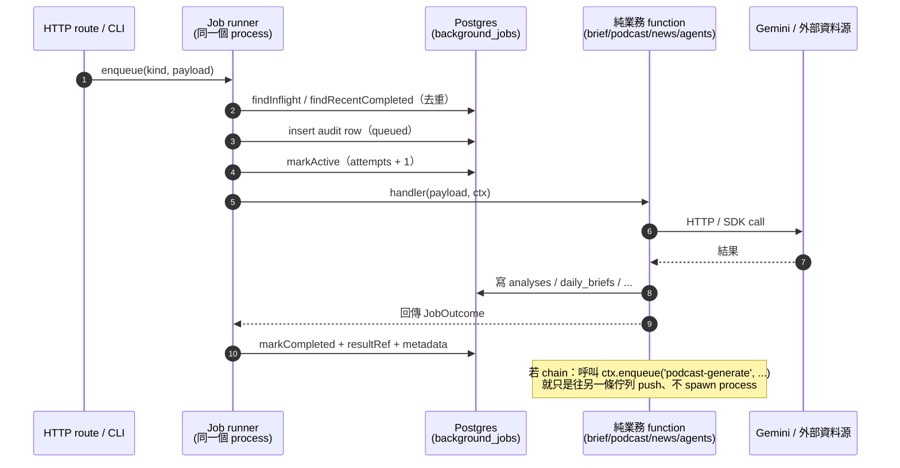

# apps/server — HTTP + job runner + CLI + LLM agents

8 個 job handler、15 個 LLM agent、第三方整合、pipeline CLI。是這個 repo 唯一會打 Gemini / FRED / TWSE / 跑爬蟲的地方。

全圖見 [模組地圖](../../docs/architecture/module-map.md)、job 與 chain 行為見其「Apps：對外 surface § apps/server」段。

## 目錄

```
apps/server/
├── src/
│   ├── index.ts                 # startup check → failAllInflight → runner.start() → serve()
│   ├── http/                    # createApp()、routes/
│   ├── jobs/
│   │   ├── specs.ts             # 每個 kind 的預設併發 + env override 名
│   │   ├── create-server-runner.ts  # runner 組裝（server entry 與 CLI 共用）
│   │   └── handlers/            # 薄殼：呼叫純業務 fn、回傳 resultRef 與 metadata（8 個 *-worker.ts）
│   ├── agents/                  # LLM agent runner、fanout、claim binding、provider adapter 等
│   │   ├── orchestrator.ts          # 編排器：decomposer → retriever → analyst → synthesizer
│   │   ├── llm-wrapper.ts           # callAgentLLM()：三個 provider（Gemini/Anthropic/OpenAI 相容）共用的呼叫入口，含 retry/timeout/cost/呼叫記錄
│   │   ├── providers/               # gemini.ts / anthropic.ts / openai.ts adapter + resolve.ts（model/provider 解析）
│   │   └── ...                      # 其餘 agent runner、normalize、schema、fanout 等（這個目錄最大，見下方「約束」）
│   ├── prompts/                 # 每個 LLM agent 的 system prompt，集中一處、方便整份替換（見 prompts/README.md）
│   ├── brief/                   # 純業務：runDailyBrief、cascade routing、cache-key
│   ├── corpus/                  # 純業務：corpus refresh
│   ├── news/                    # 純業務：news refresh（多 source 並抓）
│   ├── market-data/             # 純業務：FRED + TWSE 拉序列 + snapshot/calendar 純函式
│   ├── podcast/                 # 純業務：runPodcastGenerate、runPodcastTts
│   ├── podcast-tts/             # TTS client 與 helper（Gemini native TTS 或 Azure Speech、二選一）
│   ├── prompt-research/         # 薄殼：runPromptRefresh（委派 @suanomics/prompt-research）
│   ├── transcript/              # YouTube URL / videoId 解析
│   ├── fixtures/                # fixtures:check 的樣本形狀體檢
│   ├── external/                # 第三方：scraper、rss-fetcher
│   └── _p-map.ts                # 並行限制 helper
├── tools/                       # 非 runtime（不隨容器啟動），見 module-map.md 對「什麼算 tools、什麼算 runtime」的判準
│   ├── cli/                     # pipeline CLI（見下方常用命令）＋開發期工具
│   ├── eval/                    # 離線評測工具（pairwise judge、canary、model A/B 等，見 evaluation 文件）
│   └── ci/                      # 守門測試（llm-chokepoint、gemini-only-paths、llm-cli-manifest）
├── scripts/
│   └── entrypoint.sh            # 容器啟動：pnpm db:migrate → exec node dist/index.js
└── data/
    └── entity-aliases.yml       # 中英文別名對照表（見 prompts/README.md）
```

## Entry

`src/index.ts`：startup config 檢查 → `audit.failAllInflight('server restarted')` → `createServerRunner()` → `createApp()` → `runner.start()` → `serve()`。`SIGTERM` / `SIGINT` 先關 HTTP、再等 runner 收尾（最多 30 秒），然後退出。

## Runtime model（容器內到底怎麼跑）

> 重點：agent **不是** 獨立的 console app、worker **不是** child process。整個 `server` 容器 = **一個** Node.js process，HTTP 也在裡面。

### 啟動流程

```
Dockerfile.server CMD
  └─ /src/apps/server/scripts/entrypoint.sh
       └─ pnpm --filter @suanomics/db run db:migrate
       └─ exec node dist/index.js          ← 唯一的 process
            ├─ audit.failAllInflight()     ← 上一次執行留下的 queued/active 一律標 failed
            ├─ createServerRunner()        ← 8 個 kind 各一條記憶體佇列
            └─ serve()                     ← Hono HTTP（PORT，預設 3000）
```

八條佇列只是同一個 process 裡的八個陣列，共用同一個 V8 event loop。

### 一個 job 從 enqueue 到完成



關鍵：

- **handler 是普通 async function**、不是 spawn 子 process / fork / worker_thread。
- **agent runner（`agents/orchestrator.ts` 等）** 也只是 function、被 handler 同 process call。LLM call 是 `await llmWrapper(...)`、阻塞在 HTTP（非阻塞 event loop）。
- **chain enqueue**（brief → podcast-generate → podcast-tts）是 `ctx.enqueue()` 往另一個 kind 的佇列 push、不是直接 call function。它與父 job 併行跑（不同 kind 各有自己的併發額度）。
- **retry 在 runner 這一層**：3 次、5 秒起的 exponential backoff；中途失敗不寫 audit，只有最後一次才標 `failed`。backoff 期間不佔併發額度。

### Concurrency 數學

| Job kind | 預設 concurrency | env override |
|----------|-----------------:|--------------|
| corpus-refresh | 2 | `CORPUS_REFRESH_CONCURRENCY` |
| analyze | 1 | `ANALYZE_CONCURRENCY` |
| daily-brief | 1 | `DAILY_BRIEF_CONCURRENCY` |
| podcast-generate | 1 | `PODCAST_GENERATE_CONCURRENCY` |
| podcast-tts | 1 | `PODCAST_TTS_CONCURRENCY` |
| news-refresh | 2 | `NEWS_REFRESH_CONCURRENCY` |
| prompt-refresh | 1 | `PROMPT_REFRESH_CONCURRENCY` |
| market-data-refresh | 1 | `MARKET_DATA_REFRESH_CONCURRENCY` |

單一容器最多同時跑 **10 個 in-flight job**（2+1+1+1+1+2+1+1）。concurrency 是「同一個 kind 最多幾個 promise 並行」、不是 process 數。要更高吞吐先調 concurrency。

### 只能跑一個 instance

佇列在 process 記憶體裡，所以**不能靠加容器來水平擴充 job 那半**：第二個容器有自己的一份佇列，兩邊會各自跑同一天的工作，去重只擋得住「同時 inflight」那一瞬間。這是 2026-09-04 明確接受的取捨——個人專案的量還遠遠不到需要第二台。真的要擴，就得先把佇列搬回一個共享的地方。

同一個取捨的另一面：**job OOM 會把 HTTP 一起帶走**，而部署重啟會切斷進行中的 job（news-refresh 實測約 31 分）。開機的 `failAllInflight()` 負責把帳清乾淨，靠下一次觸發補。

### CLI scripts 不在容器內常駐

`pnpm --filter server brief:generate` 之類：

- 在 dev 機 / 開發者 SSH 進容器手跑、**不會被 entrypoint 啟動**。
- pipeline 那七支**自己起一個 runner 把工作跑完**（含 chain 出去的 job），跑到所有佇列都空才退出。退出碼 completed 0 / failed 1 / 逾時 124；`--timeout=N`（秒）可調。
- **不要在 server 跑著的時候跑 CLI**：server 開機的 `failAllInflight()` 會把 CLI 正在跑的那筆 active row 一起標成 failed。
- 部署環境的排程請打 `POST /internal/*`（任何 scheduler 都行），不要 SSH 進容器跑 CLI。
- `prompt-research-{distill,compile}.ts` 是純 local CLI、不經 job runner（僅 dev 用）。compile 產 candidate 後人工 promote、無自動 curate 階段。

### HTTP 與 job 執行的分工（同一個 process 內）

2026-09-04 之前這是兩個容器；現在是同一個 process 的兩半。

| 面向 | HTTP 那半 | job 那半 |
|------|-----------|----------|
| 入口 | `createApp()` + `serve()`（`src/http/`） | `createServerRunner()`（`src/jobs/`） |
| 對外開 port | 是（HTTP，預設 3000） | 否 |
| 與 job 的關係 | 只呼叫注入的 `enqueue` | 執行 handler、寫 audit lifecycle、chain 走 `ctx.enqueue` |
| 連 Postgres | 是（讀為主、寫 audit） | 是（寫業務資料 + audit lifecycle） |
| 關閉順序 | 先關（不再收新請求） | 後關（`runner.stop()` 讓在跑的 job 收尾） |
| 跑 LLM / scrape | 否 | 是 |

## 常用命令

```bash
pnpm --filter server dev              # tsx watch src/index.ts
pnpm --filter server start            # node dist/index.js

# pipeline CLI（自己把 job 跑完；--timeout=N 是秒）
pnpm --filter server brief:generate 2026-05-20 --timeout=2400
pnpm --filter server news:refresh
pnpm --filter server corpus:refresh
pnpm --filter server market-data:refresh
pnpm --filter server podcast:generate -- --date 2026-05-20
pnpm --filter server podcast:tts -- --date 2026-05-20
pnpm --filter server prompt:refresh -- --source=skill-financial-analyst

# 純 local（不經 job runner）
pnpm --filter server prompt:distill
pnpm --filter server prompt:compile         # 產 candidate；之後人工 promote、見 ../../docs/architecture/agents-and-prompts.md
```

## 依賴

| 來源 | 用途 |
|------|------|
| `@suanomics/db` | 全 repo + storage 寫入 |
| `@suanomics/jobs` | `createJobRunner()`、`enqueue` 與 chain、`audit` lifecycle |
| `@suanomics/shared` | `MarketBrief` / `Podcast` schema、compliance helper |
| `@suanomics/prompt-research` | prompt pipeline runtime |
| `@google/genai` | Gemini LLM + TTS |
| 其他 | `cheerio` / `commander` / `js-yaml` 等 |

## 約束

- 禁 import `apps/web`（lint zone 強制）。
- `agents/` 內三個 provider adapter（`providers/{gemini,anthropic,openai}.ts`）**只能**由 `agents/llm-wrapper.ts` 的 `callAgentLLM()` 直接 import，由 `tools/ci/llm-chokepoint.ts` 機械守門；`podcast-tts/`（TTS）與 `packages/prompt-research`（依賴方向限制，見 [agents-and-prompts.md](../../docs/architecture/agents-and-prompts.md)）各自有自己的 LLM 呼叫路徑，不受這道守門檢查限制。
- 第三方 HTTP 呼叫沒有單一機械擋住的入口，分散在多個目錄（`external/`、`market-data/`、`corpus/sources/`、`podcast-tts/`、`agents/providers/`、`fixtures/`）；`external/` 只集中了 scraper 與 RSS fetcher 兩支。
- 每個 LLM agent 的 system prompt **必須** 放 `src/prompts/`（檔名 `<name>.prompt.ts`），不與 agent runner 同 dir；見 [`src/prompts/README.md`](src/prompts/README.md)。
- DB migration 由 `scripts/entrypoint.sh` 在開機時跑一次（單一 process，沒有第二個容器會跟它搶）。

## 部署

`Dockerfile.server`（repo root）——一個容器同時跑 HTTP 與所有 job。
主機無關的部署事實見 [deploy](../../docs/operations/deploy.md)，參考 compose 是 `docker-compose.deploy.yml`。
