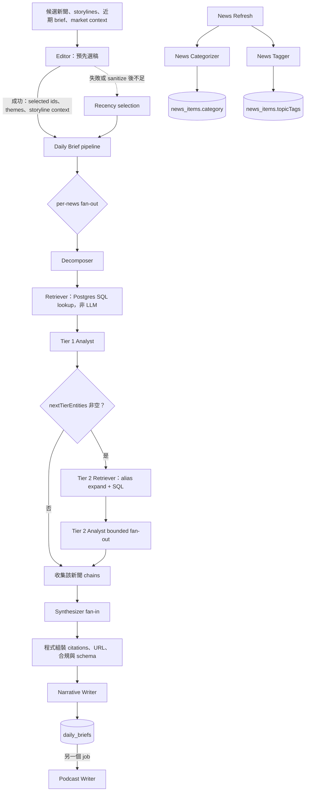
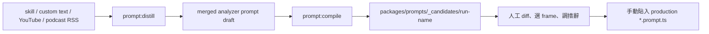

# Agents 與 Prompts

本頁依目前程式碼說明會被實際呼叫的 LLM 職責、prompt 契約、structured output 與失敗語意；不複製 prompt 全文。想先了解 API、queue、Worker 與資料落地順序，見 [Runtime Flows](runtime-flows.md)。

## Agent、Stage 與 Helper 的差別

這三種名稱在文件中有刻意區分：

- **Agent**：有明確角色 prompt、動態 user content，並呼叫模型產出文字或 structured output。例如 Decomposer、Tier 1 Analyst。
- **Stage**：控制資料何時進出、是否 fan-out／fan-in、如何降級。主要是 [`orchestrator.ts`](../../apps/server/src/agents/orchestrator.ts) 與 [`brief-worker.ts`](../../apps/server/src/jobs/handlers/brief-worker.ts)；它們不扮演 LLM 角色。
- **Helper／infrastructure**：執行確定性工作。Retriever 以 [`retriever.ts`](../../apps/server/src/agents/retriever.ts) 查 Postgres；[`llm-wrapper.ts`](../../apps/server/src/agents/llm-wrapper.ts) 與 [`providers/`](../../apps/server/src/agents/providers/) 負責模型選擇、呼叫、retry、timeout、token 與成本紀錄。這些都不是 agent。

因此「multi-agent pipeline」不代表每個方塊都呼叫 LLM。控制流與 SQL lookup 留在程式層，prompt 只負責需要語意判斷或文字生成的部分。

## 主分析 Pipeline

Daily Brief 的 Editor 發生在主 pipeline 之前：它先從候選池選稿，成功才把選稿順序、主軸與 storyline context 交給 `runDailyBrief`；失敗則回退到 recency selection。主 pipeline 對每則新聞 fan-out，最後再由 Synthesizer fan-in。Podcast 是報告落地後的另一個 job，不在同一個同步呼叫鏈內。



Decomposer、Retriever、Tier 1 都以單則新聞為單位。Tier 1 chain 先由 [`stampTier1`](../../apps/server/src/agents/tier2-fanout.ts) 補上 `chainId`／`tier`，只有帶 `nextTierEntities` 的 parent 才進 Tier 2。Tier 2 的 retrieve 與 LLM 呼叫以 concurrency 3 執行；任一 parent 失敗會捨棄該 parent 這次產生的全部二階結果（正常可有 1–4 支 chain），不影響其他 parent。Synthesizer 收到所有存活新聞的一、二階 chain，產生 prose 與 selected-news reference；真實 URL、citations 與 disclaimer 由 [`assemble.ts`](../../apps/server/src/brief/assemble.ts) 組裝。

News Categorizer 與 News Tagger 則是 news refresh 的兩條獨立 enrichment branch。它們不參與上述分析 fan-in；失敗時保留未分類／未標籤資料，之後由選稿邏輯使用 fallback。

## 共用 LLM Runtime

### 模型解析與 provider gate

（每個環境變數對應到 `apps/server/.env.example` 的哪一行、要不要填，見 [環境設定](configuration.md)；這裡講的是背後的解析規則。）

[`providers/resolve.ts`](../../apps/server/src/agents/providers/resolve.ts) 的 `AgentName` 目前有 15 個值：十二個 runtime agent 加三個 eval judge。下表同時列出 [`llm-wrapper.ts`](../../apps/server/src/agents/llm-wrapper.ts) 的 timeout 與 max tokens；Gemini 走 response schema，wrapper 不替 Gemini 設定 max output token，這欄只適用於 Anthropic 與 OpenAI 相容路徑（`llm-wrapper.ts` 143-148 把同一個 `maxTokens` 傳給兩者）。

| AgentName | 類型 | 預設 model | Timeout | Max tokens（Anthropic／OpenAI 相容路徑）|
|---|---|---|---:|---:|
| `editor` | runtime | `gemini-3.7-flash` | 45 秒 | 4,096 |
| `decomposer` | runtime | `gemini-3.7-flash` | 30 秒 | 4,096 |
| `analyst-tier1` | runtime | `gemini-3.7-flash` | 90 秒 | 4,096 |
| `analyst-tier2` | runtime | `gemini-3.7-flash` | 90 秒 | 4,096 |
| `synthesizer` | runtime | `gemini-3.7-flash` | 60 秒 | 4,096 |
| `narrative-writer` | runtime | `gemini-3.1-pro-preview` | 120 秒 | 8,192 |
| `podcast-writer` | runtime | `gemini-3-flash-preview` | 90 秒 | 8,192 |
| `news-categorizer` | runtime | `gemini-3.5-flash-lite` | 30 秒 | 2,048 |
| `news-tagger` | runtime | `gemini-3.5-flash-lite` | 30 秒 | 2,048 |
| `viewpoints-debate` | runtime | `gemini-3.7-flash` | 60 秒 | 4,096 |
| `chain-grouper` | runtime | `gemini-3.5-flash-lite` | 30 秒 | 2,048 |
| `corpus-entity-summary` | runtime | `gemini-3.5-flash-lite` | 45 秒 | 2,048 |
| `brief-judge` | eval | `gemini-3.5-flash` | 120 秒 | 8,192 |
| `brief-quality-judge` | eval | `gemini-3.5-flash` | 120 秒 | 8,192 |
| `brief-continuity-judge` | eval | `gemini-3.5-flash` | 120 秒 | 8,192 |

四個 `gemini-3.5-flash-lite` 是 2026-08-02 的分層決策：分類／抽標籤／單篇摘要這種低複雜度高量路徑不需要 flash 的推理餘裕。分層全貌與價格見 [`providers/pricing.ts`](../../apps/server/src/agents/providers/pricing.ts)。

`AGENT_MODELS` 可用 `agent:model,agent:model` 或 `agent:provider/model` 逗號分隔覆寫個別 agent。provider 解析順序（見 [`providers/resolve.ts`](../../apps/server/src/agents/providers/resolve.ts) 的 `resolveAgentModel`）：① AGENT_MODELS 值裡顯式的 `provider/model` 前綴 → ② 全域 env `LLM_PROVIDER` → ③ legacy 啟發式（model 以 `claude` 開頭視為 Anthropic）→ ④ 其餘一律 Gemini。**`provider/model` 的切法只認已知 provider 名**：只有 `/` 左半剛好是 `gemini`／`anthropic`／`openai` 才會被當成前綴切開，OpenRouter／HuggingFace 風格本身含 `/` 的 model 名（例如 `meta-llama/Llama-3.3-70B-Instruct`）會整串當成 model、不會被誤切（`parseModelSpec`）。

不管走上面①②③哪一條路解析出 `provider === 'anthropic'`，都要再通過同一組兩道 gate 才會真的打 Anthropic：`AI_PROVIDER` trim 並轉小寫後等於 `anthropic`、且存在 `ANTHROPIC_API_KEY`；任一條不滿足就 warning 一次並回退 `gemini-3.5-flash`。**「model 是 `claude*`」不是通用第三道 gate**，它只在③ legacy 啟發式（沒有顯式 `provider/` 前綴、也沒有全域 `LLM_PROVIDER=anthropic`）這條路才會被檢查；走①顯式 `anthropic/model` 前綴或②全域 `LLM_PROVIDER=anthropic` 時，即使 model 名不是 `claude*`，只要兩道 gate 都開就會照樣把那個 model 名送去 Anthropic 端點（可能因為 model 不存在而失敗）。因此只放入 Anthropic key 不會意外產生 Claude 花費，但顯式指定 provider 時 model 名稱是否合理要自己確認。openai 沒有這種 silent fallback：缺 `OPENAI_API_KEY`／`LLM_API_KEY` 會在啟動檢查（`checkStartupConfig`）擋下來，或在第一次呼叫時 throw，不會偷偷換回 Gemini。

### 接自己的 LLM

預設全部 agent 走 Gemini。要換成自己的 model（自架 vLLM／Ollama，或 OpenRouter 這類 OpenAI 相容端點），會用到下面幾個 env：

| Env | 作用 |
|---|---|
| `LLM_PROVIDER` | 全域預設 provider（`gemini`／`anthropic`／`openai`）；套用到所有沒有顯式 `provider/` 前綴的 agent。 |
| `OPENAI_API_KEY`（或 `LLM_API_KEY`） | OpenAI 相容端點的金鑰，兩者擇一即可（`OPENAI_API_KEY` 優先）。 |
| `OPENAI_BASE_URL`（或 `LLM_BASE_URL`） | OpenAI 相容端點位址，未設時預設 `https://api.openai.com/v1`；自架服務或 OpenRouter 改這個。 |
| `AGENT_MODELS` | 逐 agent 覆寫 model（`agent:model` 或 `agent:provider/model` 逗號分隔）。**只換 `LLM_PROVIDER` 而不覆寫 model，預設的 `gemini-*` model 名會原樣送去新端點**，要等到第一次呼叫才因 model not found 失敗——換 provider 時通常要跟這個一起設。 |

範例：把全部 agent 換到某個 OpenAI 相容端點（例如 OpenRouter 上的一個 model），完全不留 Gemini 依賴。**`AGENT_MODELS` 只要有任何一筆，`checkStartupConfig` 就會當作使用者已經知道要換 model、不再提醒**（見 `packages/shared/src/startup-config.ts` 的 `globalProviderModelMismatch`）——這代表沒被列進 `AGENT_MODELS` 的 agent 會靜默沿用 `AGENT_MODEL_DEFAULTS` 那些 `gemini-*` 的 model 名、原樣送去 OpenAI 相容端點，直到第一次呼叫才因 model not found 失敗。所以要嘛像下面這樣把 `AgentName` 的全部 15 個值都列出來，要嘛保留 `GEMINI_API_KEY` 讓沒覆寫的 agent 繼續走 Gemini（見下一段）：

```
LLM_PROVIDER=openai
OPENAI_API_KEY=sk-xxx
OPENAI_BASE_URL=https://openrouter.ai/api/v1
AGENT_MODELS=decomposer:meta-llama/Llama-3.3-70B-Instruct,analyst-tier1:meta-llama/Llama-3.3-70B-Instruct,analyst-tier2:meta-llama/Llama-3.3-70B-Instruct,synthesizer:meta-llama/Llama-3.3-70B-Instruct,editor:meta-llama/Llama-3.3-70B-Instruct,narrative-writer:meta-llama/Llama-3.3-70B-Instruct,podcast-writer:meta-llama/Llama-3.3-70B-Instruct,brief-judge:meta-llama/Llama-3.3-70B-Instruct,brief-quality-judge:meta-llama/Llama-3.3-70B-Instruct,brief-continuity-judge:meta-llama/Llama-3.3-70B-Instruct,news-categorizer:meta-llama/Llama-3.3-70B-Instruct,news-tagger:meta-llama/Llama-3.3-70B-Instruct,viewpoints-debate:meta-llama/Llama-3.3-70B-Instruct,chain-grouper:meta-llama/Llama-3.3-70B-Instruct,corpus-entity-summary:meta-llama/Llama-3.3-70B-Instruct
```

（本專案自己的部署刻意讓三個 eval judge 留在 Gemini 當品質量尺，見上面 `AGENT_MODEL_DEFAULTS` 的註解——那是這個 repo 的設計決策，不是技術限制；完全自架、沒有任何 `GEMINI_API_KEY` 的使用者必須像上面一樣覆寫全部 15 個。）

也可以只換部分 agent、其餘留給預設 Gemini（此時要保留 `GEMINI_API_KEY`）。啟動時會依實際會用到的 provider 檢查缺了哪把金鑰，缺了會在啟動 log 與 `GET /api/ops/config-health` 直接列出來。

### 換不掉的路徑

上面兩節講的是主 pipeline 十五個 agent 都能透過 `AGENT_MODELS` / `LLM_PROVIDER` 換掉 provider。但 repo 裡另外有 7 個檔案直接 `import ... from '@google/genai'`，繞過 provider 抽象、換 provider 換不掉。這是明確的決定，不是漏做：

| 檔案 | 為什麼換不掉 |
|---|---|
| [`apps/server/src/agents/providers/gemini.ts`](../../apps/server/src/agents/providers/gemini.ts) | Gemini adapter 本身——provider-neutral 抽象層的實作，不是需要標註的例外 |
| [`apps/server/tools/eval/model-ab/targets.ts`](../../apps/server/tools/eval/model-ab/targets.ts) | `probeModelVersions` 讀 Gemini 回應專屬的 `modelVersion` 欄位，`ProviderCallResult` 沒有、也不該定義這個概念 |
| [`packages/prompt-research/src/gemini-client.ts`](../../packages/prompt-research/src/gemini-client.ts) | 見下方「依賴方向約束」 |
| [`packages/prompt-research/src/audio/gemini-stt.ts`](../../packages/prompt-research/src/audio/gemini-stt.ts) | 依賴方向約束同左，另外語音轉文字＋大檔案走 Gemini File API，形狀本來就不是「OpenAI 相容 chat completions」 |
| [`packages/prompt-research/src/sources/yt-transcript/segmenter.ts`](../../packages/prompt-research/src/sources/yt-transcript/segmenter.ts) | 依賴方向約束同左 |
| [`packages/prompt-research/src/sources/yt-transcript/lens-extractors.ts`](../../packages/prompt-research/src/sources/yt-transcript/lens-extractors.ts) | 依賴方向約束同左 |
| [`packages/prompt-research/src/sources/yt-transcript/consolidator.ts`](../../packages/prompt-research/src/sources/yt-transcript/consolidator.ts) | 依賴方向約束同左 |

**依賴方向約束**：`packages/prompt-research`（Transcript Tool，這個 repo 的第二個產品）不能 import `apps/server/src/agents/providers/`——依賴方向是 server → prompt-research，反過來會成環。要讓 Transcript Tool 也 provider-neutral，等於把整個 provider 抽象層搬進共用 package，是一次真正的架構重寫。這裡採用的判準是「不重寫還能動的東西」，所以這裡的決定是把這 5 個檔案明確標成 Gemini-only、留清楚的換 provider 入口點，而不是假裝它們可攜。

這份清單的 single source of truth 是 [`apps/server/tools/ci/gemini-only-paths.ts`](../../apps/server/tools/ci/gemini-only-paths.ts)；[`gemini-only-paths.test.ts`](../../apps/server/tools/ci/gemini-only-paths.test.ts) 會窮舉全 repo 比對，CI 跑得到。

**這個閘門守的範圍，不等於這一節的標題。** 它的判準是「原始碼裡出現 `@google/genai` 的 import specifier」，所以它擋得住的是**新增一條直接 import SDK 的路徑**，以及**清單裡的條目過期**。它擋不住的至少有兩種：用 `fetch` 直接打 Gemini 的 HTTP endpoint（完全不碰 SDK），以及包在上面某個已列檔案裡、透過它間接綁死 Gemini 的新程式碼。換句話說，**清單為真不代表窮盡**——它是一份「已知的、機器盯得住的」綁定，不是「全 repo 只有這 7 條路換不掉」的保證。

### 呼叫契約與觀測

共同呼叫依序分成四層，修改時不要把責任混在一起：

| 層 | 責任 | 目前來源 |
|---|---|---|
| System prompt | 定義角色、推理／寫作紀律、引用與合規限制 | 各 agent 的 `*.prompt.ts` |
| User-content builder | 把本次新聞、上游結果、allowlist 與 context 組成動態輸入 | 各 runner 的 `format*UserContent` 或同等程式 |
| Provider response schema | 約束模型可輸出的 JSON 形狀 | 各 runner 的 hand-written Gemini schema；Anthropic 轉為 forced `emit_result` tool schema |
| 驗證與後處理 | Zod parse、ID／URL allowlist、truncate、sanitize、組裝與 graceful degradation | runner、normalizer、shared schema 與 assemble／analyzer |

`callAgentLLM` 預設最多呼叫 3 次，重試間隔為 1 秒、2 秒遞增；`AbortError` 直接拋出、不在 wrapper retry。Gemini provider 要求 JSON MIME type、使用 response schema，並在 provider 內 `JSON.parse`；Anthropic provider 強制呼叫單一 `emit_result` tool，且對 system prompt 設 ephemeral prompt cache。兩者都由 `AbortController` 執行 per-agent timeout。

每次成功 provider call 都會在 wrapper 建立 `LlmCallRecord`：agent、可選 news id、input/output tokens、成本、延遲、attempts、provider，以及可用的 cache read／write tokens；只有 caller 傳入 `onCallRecord` 時才會把 record 送回。成本由 [`pricing.ts`](../../apps/server/src/agents/providers/pricing.ts) 依 provider、model 與 token usage 計算；Daily Orchestrator 有提供 callback，因此會把收到的 record 累加到 metadata 的 `llmCalls`、`totalCostUsd` 與 `totalLatencyMs`。Tier 1／2 Analyst 會暫存最後一筆真實 LLM record；若最後仍需 strip fabricated citations，就在那筆 record 加上 `fabricationStripped` 後送出，不另造零成本紀錄。

Narrative Writer 與 Podcast Writer 回傳值內的 writer-specific `audit` object 不依賴 callback，caller 一定能用它判斷成功或 graceful degrade。另一方面，Synthesizer、Narrative Writer、Podcast Writer 的 audit helper 只有在 `onCallRecord` 存在時，才會額外送出 `attempts: 0`、`costUsd: 0` 的 terminal `LlmCallRecord`。Daily Orchestrator 傳 callback 給 Synthesizer 與 Narrative Writer，所以這些 record 會進 daily metadata；production [`runPodcastGenerate`](../../apps/server/src/podcast/generate.ts) 呼叫 Podcast Writer 時沒有傳 callback，因此該 job path 不會收集 provider 或 terminal `LlmCallRecord`，但仍會讀取函式回傳的 `result.audit`。

## Runtime Agents

### Editor

| 欄位 | 說明 |
|---|---|
| 角色 | 執行主編：在五類候選間依當日重要性選稿，產生 1–2 個主軸，並判斷既有 storyline 的 `support`／`challenge`／`extend`、少量 resolve 與新 storyline。 |
| 觸發 | [`selectNewsViaEditor`](../../apps/server/src/jobs/handlers/brief-worker.ts) 在 daily brief 主 pipeline 前呼叫；候選由 relevance ranker 排序。 |
| Runner | [`editor.ts`](../../apps/server/src/agents/editor.ts)；caller 的防呆在 [`editor-output.ts`](../../apps/server/src/agents/editor-output.ts)。 |
| System prompt | [`editor.prompt.ts`](../../apps/server/src/prompts/editor.prompt.ts)：只能選候選 id、避免同事件重複、維持類別廣度、storyline note 寫相對既有論點的 delta，且不用投資建議語氣。Prompt 要求選 5–8 則；程式 schema 容許 1–8，sanitize 後至少 2 則才採用。 |
| User content | 候選 `id/title/excerpt/category`、open storylines 與最近三筆 update、近三日 brief、可選的 calendar block 與 market snapshot；標題／摘要會 clamp。 |
| Structured output | [`EditorOutputSchema`](../../apps/server/src/agents/editor-output.ts) 是完整契約，但拆成兩個獨立 contract 各自 parse：選稿層 `EditorSelectionSchema`（`mainThemes`、`dailyThesis`、`selectedNewsIds`）與敘事線層 `EditorStorylineSchema`（`storylineTouches`、`resolveStorylines`、`newStorylines`）。 |
| Model / timeout | `gemini-3.5-flash`；45 秒；可由 `AGENT_MODELS` 覆寫；Anthropic 路徑 4,096 max tokens。 |
| 驗證與後處理 | `parseEditorOutput` 對兩層各自 safeParse，敘事線層再逐筆容錯（陣列內單筆不合只丟那一筆）。`sanitizeSelection` 只留真實 candidate id、去重，並以選稿至少 2 則設定 `ok`；`sanitizeStoryline` 只留 open-storyline id、touch／resolve 同 storyline 採 last-wins、新線最多 2 條。 |
| 失敗語意 | 共用 wrapper retry；前置 DB 或 LLM 失敗由 caller catch，回退 recency selection，不阻擋 daily brief。**兩層獨立降級**：選稿層不可用時仍照常寫回敘事線（但不餵 `storylineBlock`／`continuityHint`／`dailyThesis` 給 narrative——它們與 fallback 選稿對不上）；敘事線層不可用時選稿照常採用。Storyline 寫回另為 best-effort。 |

### Decomposer

| 欄位 | 說明 |
|---|---|
| 角色 | 把單則財經新聞拆成主要實體、主題標籤與最多六條可供檢索的 cascade hypothesis。 |
| 觸發 | [`runDailyBrief`](../../apps/server/src/agents/orchestrator.ts) 對每則選稿 fan-out；single-news／full-pipeline 也直接呼叫。 |
| Runner | [`decomposer.ts`](../../apps/server/src/agents/decomposer.ts)，共用輸出型別在 [`types.ts`](../../apps/server/src/agents/types.ts)。 |
| System prompt | [`decomposer.prompt.ts`](../../apps/server/src/prompts/decomposer.prompt.ts)：產業層級 hypothesis、具體因果、不可虛構數字或 citation，並要求產業／公司題至少包含一條相關的地緣、政策或監管跨域 hypothesis。 |
| User content | 單則 `newsTitle` 與 `newsText`；`newsId` 只進 call record，不放進 prompt。 |
| Structured output | `DecomposerOutputSchema`：`primaryEntity{name,kind}`、最多 5 個 `topicTags`、0–6 個 `cascadeHypotheses{industry,mechanism,retrieveQuery}`；query 可含 entities、topics 與正整數 days（預設 7）。 |
| Model / timeout | `gemini-3.5-flash`；30 秒；可覆寫；Anthropic 路徑 4,096 max tokens。 |
| 驗證與後處理 | Gemini response schema 先限制形狀，再由 `DecomposerOutputSchema.parse` 驗證。Retriever 前由 Orchestrator 對 query entities 做 alias expansion；不是 prompt 的工作。 |
| 失敗語意 | 共用 wrapper retry。Daily fan-out 用 `Promise.allSettled` 排除失敗新聞並記錄 partial success；存活少於 2 則時整個 daily brief 失敗。Single-news 路徑則直接失敗。 |

### Tier 1 Analyst

| 欄位 | 說明 |
|---|---|
| 角色 | 對主新聞、Decomposer hypotheses 與檢索文章寫第一層影響鏈，列產業方向、受影響 ticker、citations，並可用 `nextTierEntities` 提名二階 partner。 |
| 觸發 | [`runDailyBrief`](../../apps/server/src/agents/orchestrator.ts)、single-news／analyst-only routing；daily 路徑會帶主新聞真實 URL。 |
| Runner | [`analyst-tier1.ts`](../../apps/server/src/agents/analyst-tier1.ts)；共用 schema normalization 在 [`analyst-shared.ts`](../../apps/server/src/agents/analyst-shared.ts)。 |
| System prompt | [`analyst-tier1.prompt.ts`](../../apps/server/src/prompts/analyst-tier1.prompt.ts)：以具體、可讀、合規語言寫 cascade；citation 只能來自主新聞或 retrieve allowlist；distilled frames 後再接手寫 [`macro-frames.ts`](../../apps/server/src/prompts/macro-frames.ts) 區段。 |
| User content | 主新聞標題／內文、可選相對發布日、Decomposer 結果、主新聞 URL、retrieved URL／標題／摘要、可選 prior chains、market-close framing 與 market snapshot。Prior chains 明示不可當 citation。 |
| Structured output | `AnalystOutputSchema`：可選 `newsId`、`primaryImpact`、`cascadeChains`、`reasoning`；每條 chain 含 industry、mechanism、affectedTickers、sector direction、0–5 citations，Tier 1 可另有最多 5 個 `nextTierEntities`。 |
| Model / timeout | `gemini-3.5-flash`；90 秒；可覆寫；Anthropic 路徑 4,096 max tokens。 |
| 驗證與後處理 | Citation quote 先截到 600 字再 Zod parse；allowlist 是所有 retrieved URL 加上合法 `http(s)` 主新聞 URL。缺 `newsId` 時補 caller id；之後 `stampTier1` 補 `t1-N`、`tier=1`，並移除與 `affectedTickers` 重複的 next-tier entity。 |
| 失敗語意 | Wrapper 處理 provider retry；fabricated URL 驗證預設最多 3 次總產出（首輪 + 最多 2 次附 feedback 的 retry）。最後仍違規就 strip 非 allowlist citation、保留分析，並在最後一筆真實 LLM record 標記 `fabricationStripped`。其他例外在 daily 只淘汰該新聞；若存活不足 2 則才阻擋整份 brief。 |

### Tier 2 Analyst

| 欄位 | 說明 |
|---|---|
| 角色 | 沿單一 Tier 1 parent chain 分析第二層傳導，只處理 parent 提名的 `nextTierEntities` 與對應 retrieve 結果；不再產第三層提名。 |
| 觸發 | [`runTier2Fanout`](../../apps/server/src/agents/tier2-fanout.ts) 只對 `nextTierEntities` 非空且已有 `chainId` 的 Tier 1 parent 執行；先 alias expand，再查最近 7 日文章。 |
| Runner | [`analyst-tier2.ts`](../../apps/server/src/agents/analyst-tier2.ts)；fan-out／parent stamping 在 [`tier2-fanout.ts`](../../apps/server/src/agents/tier2-fanout.ts)。 |
| System prompt | [`analyst-tier2.prompt.ts`](../../apps/server/src/prompts/analyst-tier2.prompt.ts)：把 parent 當 context 而非 citation、只寫有 retrieve 證據的二階傳導、不可輸出 `nextTierEntities`。 |
| User content | 主新聞標題／內文、parent industry／mechanism／`nextTierEntities`、該 parent 的 retrieved URL／標題／摘要，以及可選 market snapshot。`chainId` 不進 prompt；它是 fan-out 保留的控制 metadata，之後用來蓋 `parentChainId`。 |
| Structured output | 同 `AnalystOutputSchema`，但 provider response schema 刻意沒有 `nextTierEntities`；fan-out 再蓋 `chainId=t2-N`、`tier=2`、`parentChainId`，並強制 `nextTierEntities=undefined`。 |
| Model / timeout | `gemini-3.5-flash`；90 秒；可覆寫；Anthropic 路徑 4,096 max tokens。 |
| 驗證與後處理 | Quote normalization、Zod parse與 retrieved-URL allowlist 與 Tier 1 相同。程式依 parent chain 寫入 `parentChainId`；若輸出 chain 沒有 citation，程式而非 LLM 標記 `speculative: true`。 |
| 失敗語意 | Retriever 空集合直接不呼叫 agent。Fabricated URL 驗證預設最多 3 次總產出（首輪 + 最多 2 次 retry），耗盡後 strip，並 enrich 最後一筆真實 LLM record。每個 parent 的 retrieve／agent 例外都由 bounded fan-out catch；失敗會捨棄該 parent 的整組二階 chains，只 warning、不阻擋其他 parent 或 daily brief。 |

### Synthesizer

| 欄位 | 說明 |
|---|---|
| 角色 | 將多篇 Analyst 結果 fan-in 成 headline、summary、跨篇關係、受影響產業／ETF 與 reasoning chain；只產 prose 與 news-id reference，不產真實 URL 或 disclaimer。 |
| 觸發 | [`runDailyBrief`](../../apps/server/src/agents/orchestrator.ts) 在至少兩篇 Analyst 存活後呼叫一次。 |
| Runner | [`synthesizer.ts`](../../apps/server/src/agents/synthesizer.ts)；確定性組裝接著由 [`assemble.ts`](../../apps/server/src/brief/assemble.ts) 執行。 |
| System prompt | [`synthesizer.prompt.ts`](../../apps/server/src/prompts/synthesizer.prompt.ts)：找跨篇共同傳導、自然納入二階 chain、推測 chain 用條件語氣，不暴露 tier id，遵守合規禁詞。 |
| User content | 報告日期、每篇 Analyst 的 primary impact／chains／citations URL／reasoning、可選 market snapshot、台股收盤 framing 與 continuity hint；`speculative` chain 有明確提示。 |
| Structured output | `SynthesizerOutputSchema`：headline、summary、`relatedNews{newsId,relationType,reasoning}`、affectedIndustries、relatedETFs、2–6 條 reasoningChain。 |
| Model / timeout | `gemini-3.5-flash`；60 秒；可覆寫；Anthropic 路徑 4,096 max tokens。 |
| 驗證與後處理 | 先對超長 prose／陣列做 normalization，再 Zod parse。若合規掃描命中，最多 3 輪要求整段重寫；耗盡後只對 prose 做 rewrite-map sanitize。之後 assemble 以 selected-news id resolve 真 URL、由 Analyst chains 組 citations、補固定 disclaimer，最後 [`finalizeBriefSafety`](../../apps/server/src/brief/analyzer.ts) 再 sanitize、sentence-strip、clamp 與 `MarketBriefSchema.parse`。 |
| 失敗語意 | Provider 由 wrapper retry；合規 violation 有獨立 3 輪。若有 parseable 最後版本則 terminal sanitize 後繼續並記 audit；provider／Zod 例外或完全無可 parse output 會阻擋 daily brief。 |

### Narrative Writer

| 欄位 | 說明 |
|---|---|
| 角色 | 把已組裝的 brief、多篇 Analyst 結果與 Editor 主軸寫成主題式長文；段落跨新聞編織，不逐則摘要。 |
| 觸發 | [`runDailyBrief`](../../apps/server/src/agents/orchestrator.ts) 在真實 citations、related-news URL 與合規 brief 已完成組裝後呼叫。 |
| Runner | [`narrative-writer.ts`](../../apps/server/src/agents/narrative-writer.ts)；pre-normalization 在 [`narrative-writer.normalize.ts`](../../apps/server/src/agents/narrative-writer.normalize.ts)。 |
| System prompt | [`narrative-writer.prompt.ts`](../../apps/server/src/prompts/narrative-writer.prompt.ts)：以 1–4 個主題段寫連續文章，遵守相對時間與跨日 storyline 規則；每段 citation URL、related news id 只能取輸入 subset，禁止投資建議。 |
| User content | `briefDate`、Editor `mainThemes`、Synthesizer brief、market-close framing、每則新聞摘要與 Analyst chains、可用 citation URL／title／quote、calendar block、storyline block。 |
| Structured output | [`NarrativeSchema`](../../packages/shared/src/market-brief.ts)：`intro`、1–4 個 `sections{heading,body,relatedNewsIds,citationUrls}`、`outro`；最終嵌入 `MarketBrief.narrative`。 |
| Model / timeout | `gemini-3.1-pro-preview`；120 秒；可覆寫；Anthropic 路徑 8,192 max tokens。 |
| 驗證與後處理 | Prompt 限制不等於程式保證：程式移除控制字元、截長度、只留真實 citation URL／news id、citation 空時 best-effort 補第一個真 URL；再以 `MarketBriefSchema` 驗 subset。之後 rewrite 禁詞、再 clamp、重 parse，最後掃 reader-facing prose 的合規殘留。 |
| 失敗語意 | 外層最多 2 次完整嘗試；每次內部 provider call 仍有 wrapper retry。Zod、provider、timeout 或合規殘留第二次仍失敗時回 `{ narrative: null }` 並寫 audit，不阻擋 brief 落地。 |

### Podcast Writer

| 欄位 | 說明 |
|---|---|
| 角色 | 以「賽博半仙」persona 把已完成的 daily brief 改寫成有 hook、3–5 acts 與 takeaway 的口語 podcast 文稿；提供 reflection，不提供 advice。 |
| 觸發 | [`runPodcastGenerate`](../../apps/server/src/podcast/generate.ts) 在獨立 `podcast-generate` job 讀回已保存 brief 後呼叫；要求 brief 已有 narrative。 |
| Runner | [`podcast-writer.ts`](../../apps/server/src/agents/podcast-writer.ts)；provider schema 在 [`podcast-writer-schema.ts`](../../apps/server/src/agents/podcast-writer-schema.ts)，normalizer 在 [`podcast-writer.normalize.ts`](../../apps/server/src/agents/podcast-writer.normalize.ts)。 |
| System prompt | [`podcast-writer.prompt.ts`](../../apps/server/src/prompts/podcast-writer.prompt.ts)：控制 persona、口語節奏、3-act JSON 形狀、1800–2800 字、所有 news coverage、citation subset 與投信投顧禁詞。 |
| User content | 日期、reading narrative、brief headline／summary／reasoning、全部 cascade chains、brief citation allowlist、`newsTitlesById` allowlist，以及獨立 job 重新載入的 calendar／storyline block。 |
| Structured output | [`PodcastSchema`](../../packages/shared/src/podcast.ts)：日期、hook、3–5 acts、takeaway、meta；act 包含 storyline enum、citationUrls 與 relatedNewsIds。 |
| Model / timeout | `gemini-3-flash-preview`；90 秒；可覆寫；Anthropic 路徑 8,192 max tokens。 |
| 驗證與後處理 | 程式移除控制字元、clamp、acts cap 5、過濾 citation allowlist，並補 `briefDate`／固定 persona／generatedAt；`makePodcastSchemaWithCitations` 驗 URL subset。禁詞 rewrite 後重算 `totalChars` 與 timestamp，再以 `PodcastSchema` 重驗並掃合規殘留。Prompt 的「覆蓋全部 news」目前沒有額外程式 union gate。 |
| 失敗語意 | 外層最多 2 次；第二次仍有 schema、API、timeout 或 compliance 問題就回 `podcast: null` 與 audit。Agent 本身 graceful degrade，但 job caller 看到 null／failed 會拋錯，因此 podcast job 失敗，不影響已保存的 daily brief。 |

### News Categorizer

| 欄位 | 說明 |
|---|---|
| 角色 | 將每則新進財經新聞歸到 `tech-semi`、`tw-equity-other`、`macro`、`energy`、`international` 五類之一。 |
| 觸發 | [`categorizeAndStore`](../../apps/server/src/news/categorize.ts) 由 [`news/refresh.ts`](../../apps/server/src/news/refresh.ts) 對新進項目每批 15 則呼叫。 |
| Runner | [`news-categorizer.ts`](../../apps/server/src/agents/news-categorizer.ts)。 |
| System prompt | [`news-categorizer.prompt.ts`](../../apps/server/src/prompts/news-categorizer.prompt.ts)：最核心主題只能選一類，並定義科技、油價、中國議題與美國數據的 tie-break。 |
| User content | 每行一則 input id、clamp 後 title 與 excerpt。空批次不呼叫模型。 |
| Structured output | `{ results: [{ id, category }] }`；category 受 `ITEM_CATEGORIES` enum 約束。 |
| Model / timeout | `gemini-3.5-flash-lite`；30 秒；可覆寫；Anthropic 路徑 2,048 max tokens。 |
| 驗證與後處理 | 沒有另跑 Zod；`normalizeCategorizerResponse` 只留輸入 id、合法 category，重複 id 取第一筆，其他項目丟棄。 |
| 失敗語意 | Wrapper 失敗會拋出；news refresh 對 categorizer 整批 catch，保留 `category=null`，之後選稿可退來源層分類，不阻擋該 source refresh。 |

### News Tagger

| 欄位 | 說明 |
|---|---|
| 角色 | 為新聞抽 3–6 個描述具體事件／主體／動作的 canonical story tags，供 story-level 去重與聚類。 |
| 觸發 | [`tagAndStore`](../../apps/server/src/news/tag.ts) 由 [`news/refresh.ts`](../../apps/server/src/news/refresh.ts) 每批 15 則呼叫；另有 backfill script caller。 |
| Runner | [`news-tagger.ts`](../../apps/server/src/agents/news-tagger.ts)。 |
| System prompt | [`news-tagger.prompt.ts`](../../apps/server/src/prompts/news-tagger.prompt.ts)：要求小寫英文 kebab-case、具體事件標籤，避免只給泛產業詞。 |
| User content | 每行一則 input id、clamp 後 title 與 excerpt。空批次不呼叫模型。 |
| Structured output | `{ results: [{ id, tags }] }`。 |
| Model / timeout | `gemini-3.5-flash-lite`；30 秒；可覆寫；Anthropic 路徑 2,048 max tokens。 |
| 驗證與後處理 | 沒有另跑 Zod；normalizer 只留整數且屬輸入集的 id，重複 id 取第一筆；tags trim、轉小寫、去空、去重並切到 6 個。Caller 對模型漏回的 input 寫入空 tags，讓 `taggedAt` 可完成。 |
| 失敗語意 | Wrapper 失敗會拋出；news refresh catch 後讓項目維持未標狀態，之後可重跑或退 alias 邏輯，不阻擋該 source refresh。 |

## Supporting LLM Components

這些元件會呼叫 LLM 或建立 prompt，但不在主分析 pipeline 的 stage 序列裡。Corpus enrichment、eval 與 prompt research 各有自己的 caller 與生命週期；其中 corpus entity summary 與三個 judge 都列入共用 `AgentName`（走 `callAgentLLM`、成本進 `LlmCallRecord`），但 judge 只在明確執行 eval CLI 時跑、不在 daily production chain，corpus entity summary 則是每日 corpus refresh 的一部分。Transcript Tool（prompt research）那幾支不走 `callAgentLLM`，model 由 `TRANSCRIPT_TOOL_MODEL` 系列 env 決定。

| Component / prompt | 用途 | Input context | Structured／text output | Caller | Runtime status |
|---|---|---|---|---|---|
| [Corpus entity summary](../../apps/server/src/corpus/entity-summary.ts)／[prompt](../../apps/server/src/corpus/entity-summary-prompt.ts) | 為 external corpus 文章產中性摘要、entities、topic tags | 標題 + 最多 8,000 字正文 | Zod 驗證的 `{contentSummary,entities,topicTags}`；未知 kind 正規化為 `other`、tags 切 5 | [`corpus-worker.ts`](../../apps/server/src/jobs/handlers/corpus-worker.ts) | Active supporting runtime；走 `callAgentLLM`（`AgentName=corpus-entity-summary`、預設 `gemini-3.5-flash-lite`）；總嘗試次數 3 由 `entity-summary.ts` 的迴圈掌握、wrapper 以單次模式呼叫（zod 比 Gemini schema 嚴、驗證失敗會重問）；實際 model 與實算成本回寫 `external_articles`；失敗仍保存原文 |
| [Quality judge](../../apps/server/tools/eval/quality-judge.ts)／[prompt](../../apps/server/tools/eval/quality-judge.prompt.ts) | Pairwise 比較兩版 brief 的深度、可讀性、grounding | 兩版 brief + 共用事實來源 | 每維 winner／reason；交換甲乙跑兩次後程式聚合 | [`brief-quality.ts`](../../apps/server/tools/cli/brief-quality.ts) | Active eval-only；`AgentName=brief-quality-judge` |
| [Continuity judge](../../apps/server/tools/eval/continuity-judge.ts)／[prompt](../../apps/server/tools/eval/continuity-judge.prompt.ts) | Pairwise 比較跨日連續性、thesis delta、resolve payoff | 昨日 brief + 今日兩版 brief | 每維 winner／reason；交換甲乙跑兩次後程式聚合 | [`brief-continuity.ts`](../../apps/server/tools/cli/brief-continuity.ts) 與 [跨日連續性 A/B script](../../apps/server/tools/cli/storyline-continuity-ab.ts) | Active eval-only；`AgentName=brief-continuity-judge` |
| [Gemini STT](../../packages/prompt-research/src/audio/gemini-stt.ts) | 將 podcast 音訊忠實轉成逐字稿 | 音訊、MIME、episode id、可選語言；大於 18 MB 走 File API | 純文字 transcript | [`dispatchPodcastRss`](../../packages/prompt-research/src/sources/index.ts) | Active prompt-research supporting；120 秒、最多 2 attempts，File ACTIVE 最多等 5 分鐘 |
| [Transcript segmenter](../../packages/prompt-research/src/sources/yt-transcript/segmenter.ts)／[prompt builder](../../packages/prompt-research/src/sources/yt-transcript/prompts.ts) | 將逐字稿切成 `market`／`macro_event`／`joke`／`ad` 等片段，供後續濾除雜訊 | episode id + transcript + source-specific prompt vars | `SegmenterOutputSchema` JSON | [`runDeepPipeline`](../../packages/prompt-research/src/pipeline/deep-pipeline.ts) | Active deep prompt-research stage |
| Lens `events` | 抽事件、日期與 transcript segment reference | filtered transcript + episode id + prompt vars | `EventsLensSchema` JSON | [`runAllLenses`](../../packages/prompt-research/src/sources/yt-transcript/lens-extractors.ts) | Active；六 lens 並行 |
| Lens `cited_sources` | 抽節目提到的政府、學術、媒體、公司與 market-data sources | filtered transcript + episode id + prompt vars | `CitedSourcesLensSchema` JSON | [`runAllLenses`](../../packages/prompt-research/src/sources/yt-transcript/lens-extractors.ts) | Active；六 lens 並行 |
| Lens `entities` | 抽 sector、macro indicator、country／region、commodity entities | filtered transcript + episode id + prompt vars | `EntitiesLensSchema` JSON | [`runAllLenses`](../../packages/prompt-research/src/sources/yt-transcript/lens-extractors.ts) | Active；六 lens 並行 |
| Lens `reasoning_chains` | 抽 premise、推理 steps、conclusion 與 confidence | filtered transcript + episode id + prompt vars | `ReasoningChainsLensSchema` JSON | [`runAllLenses`](../../packages/prompt-research/src/sources/yt-transcript/lens-extractors.ts) | Active；六 lens 並行 |
| Lens `impacts` | 抽 sector-level direction、time horizon 與 reasoning | filtered transcript + episode id + prompt vars | `ImpactsLensSchema` JSON | [`runAllLenses`](../../packages/prompt-research/src/sources/yt-transcript/lens-extractors.ts) | Active；六 lens 並行 |
| Lens `analyst_frames` | 抽可重用的 frame pattern、適用時機、例句與強度 | filtered transcript + episode id + prompt vars | `AnalystFramesLensSchema` JSON | [`runAllLenses`](../../packages/prompt-research/src/sources/yt-transcript/lens-extractors.ts) | Active；六 lens 並行 |
| [Consolidator](../../packages/prompt-research/src/sources/yt-transcript/consolidator.ts)／[prompt builder](../../packages/prompt-research/src/sources/yt-transcript/prompts.ts) | 把多集六 lens 結果整理成可供 distill 的長篇 supplement | `EpisodeL3[]` + run id + prompt vars | Markdown text；程式掃 forbidden phrase 與 ticker-direction | [`runDeepPipeline`](../../packages/prompt-research/src/pipeline/deep-pipeline.ts) | Active deep stage；最多 3 attempts |
| [Skill distiller](../../packages/prompt-research/src/distillers/skill-to-digest.ts) | 從外部 skill／分析方法論抽可執行 frames、vocabulary、red flags | source metadata + skill Markdown | `DigestSchema` JSON；IDs 由程式 stable hash | [`dispatchSkill`](../../packages/prompt-research/src/sources/index.ts) | Active light source；最多 3 outer attempts |
| [Transcript distiller](../../packages/prompt-research/src/distillers/transcript-to-digest.ts) | 把 consolidator Markdown 轉成 compiler 可用 Digest | source metadata、consolidated Markdown、episodes、prompt vars | `DigestSchema` JSON；IDs 由程式 stable hash | [`runDeepPipeline`](../../packages/prompt-research/src/pipeline/deep-pipeline.ts) | Active deep source；YouTube 與 podcast RSS 共用 |
| [Custom-text distiller](../../packages/prompt-research/src/distillers/custom-to-digest.ts) | 將本機自訂文字沿用 skill distillation prompt 轉成 Digest | source slug、文字、local path | `DigestSchema` JSON | [`dispatchCustom`](../../packages/prompt-research/src/sources/index.ts) | Active light source；不是純 file copy，確實會呼叫 Skill distiller prompt |
| [Decomposer compiler builder](../../packages/prompt-research/src/compiler/decomposer-prompt.ts) | 將 merged draft 的 shared preamble 與全部 frames 組成 candidate Decomposer prompt | `MergedDraft` + shared preamble | TypeScript prompt string | [`compilePrompts`](../../packages/prompt-research/src/compiler/compiler.ts) | Active compile-time pure builder；不呼叫 LLM |
| [Analyst compiler builder](../../packages/prompt-research/src/compiler/analyst-prompt.ts) | 將 merged draft frames 組成單一 candidate Analyst prompt | `MergedDraft` + shared preamble | TypeScript prompt string | [`compilePrompts`](../../packages/prompt-research/src/compiler/compiler.ts) | Active compile-time pure builder；promotion 時人工決定如何映射 Tier 1／2 |
| [Synthesizer compiler builder](../../packages/prompt-research/src/compiler/synthesizer-prompt.ts) | 將全部 frames 與 red flags 組成 candidate Synthesizer prompt | `MergedDraft` + shared preamble | TypeScript prompt string | [`compilePrompts`](../../packages/prompt-research/src/compiler/compiler.ts) | Active compile-time pure builder；不呼叫 LLM |
| [Legacy market-brief prompt builders](../../apps/server/src/brief/prompts.ts) | 舊式單次 MarketBrief system／user prompt | target news + recent news | 兩段 prompt text | 無非測試 caller | Inactive／legacy；不在現行 runtime |

六個 lens 的名稱與執行順序由 [`LENS_ORDER`](../../packages/prompt-research/src/sources/yt-transcript/lens-extractors.ts) 定義；schema 集中在 [`schemas.ts`](../../packages/prompt-research/src/sources/yt-transcript/schemas.ts)，system prompt 由同一個 [`buildLensExtractorSystemPrompt`](../../packages/prompt-research/src/sources/yt-transcript/prompts.ts) 依 lens registry 選擇內容。Lens 層允許保留 KOL 原話，合規掃描集中在 consolidator output。

## Prompt Research 生命週期

Prompt research 不會直接覆寫 production prompt。現在的流程是：



`prompt:distill` 的 light source 直接經 Skill／Custom-text distiller；deep source 依序經 STT（podcast RSS 才需要）、segmenter、六 lens、consolidator、Transcript distiller。Digests 由 merger 合成 draft，再由 [`runCompile`](../../packages/prompt-research/src/compiler/cli-compile.ts) 產生 `_shared.system.ts`、`decomposer.system.ts`、`analyst.system.ts`、`synthesizer.system.ts` 四個 candidate。

Candidate 會包含 compiler 收到的 generated shared preamble、frames 與 red flags；production prompt 可能另有手寫附加區段。例如 [`analyst-tier1.prompt.ts`](../../apps/server/src/prompts/analyst-tier1.prompt.ts) 明確把 distilled body 與手寫 macro frames 串接，Editor、Narrative Writer、Podcast Writer、News Categorizer、News Tagger 則是 runtime-only 手寫 prompt，不是目前 compiler 的輸出目標。

Promotion 是人工 gate：candidate Analyst 只有一份，production 卻拆 Tier 1／Tier 2；shared candidate 在 production 多為 inline；因此不能機械 overwrite。人工 review 後才把選定內容貼入 `apps/server/src/prompts/` 對應的 `*.prompt.ts`，再測試並 commit。

本機 `prompt:distill` 以 timestamp `<runId>` 建立 `apps/server/.prompt-research-out/<runId>-run/`。接著 `prompt:compile` 的 `--run` 必須傳完整目錄名 `<runId>-run`；compile 會原樣拿這個參數當 candidate 子目錄，因此該 local CLI flow 寫到 `packages/prompts/_candidates/<runId>-run/`。若 caller 提供其他合法 run name，compile 同樣逐字使用，不應一律假設有或沒有 suffix。Queue refresh 自行產生不帶 `-run` 的 run name，並由 [`run-prompt-refresh.ts`](../../apps/server/src/prompt-research/run-prompt-refresh.ts) 只保留最近 10 個 candidate run。這些是 runtime filesystem artifacts；部署若沒有 persistent volume，不能宣稱它們具永久 durability。Prune 只處理 candidate base directory，不會替 distill output 做 retention。

## Inactive／Legacy Prompts

[`apps/server/src/brief/prompts.ts`](../../apps/server/src/brief/prompts.ts) 的 `buildMarketBriefSystemPrompt` 與 `buildMarketBriefUserPrompt` 目前是 inactive／legacy。判定依據不是檔名或舊 phase 文件，而是對 `apps`、`packages` 排除測試檔搜尋兩個 export：只有定義本身，沒有非測試 runtime caller。系統共有九個 runtime agent；Daily Brief production path 的 agent／gate 順序是：Editor（前置選稿）→ Decomposer → Tier 1 Analyst → Tier 2 Analyst → Synthesizer → assemble／safety gate → Narrative Writer。Editor 不屬於 `runDailyBrief` 內部主 pipeline。Podcast Writer 是報告落地後的 downstream queue job；News Categorizer 與 News Tagger 是 news-refresh enrichment。現行路徑不會讀 legacy builders。

歷史 design spec、change note、prompt snapshot 可以解釋演進或守住測試，但都不等於 runtime caller。要重新啟用 legacy prompt，必須先建立真實 caller、schema／allowlist／failure semantics，並同步更新本頁；不能只因檔案仍存在就視為 active。

## 修改 Prompt 時的同步清單

1. 先確認 caller：這是九個 runtime agent、supporting component、compiler candidate，還是沒有 caller 的 legacy code。
2. 同步檢查 system prompt、user-content builder、provider response schema、Zod／normalizer 四層；只改文字可能與實際 acceptance gate 矛盾。
3. 若新增／刪除欄位，同步 Gemini response schema、Anthropic forced-tool schema input、Zod schema、normalizer、caller 與 fixture；Anthropic 使用同一份 runner response schema，不另維護一套 shape。
4. Citation 契約要同時檢查 prompt 提示與程式 allowlist。Tier 1 包含合法主新聞 URL + retrieved URLs；Tier 2 只有該 parent 的 retrieved URLs；Narrative／Podcast 只能引用已組裝 brief 的 citation subset。
5. 分清 prompt constraint 與 programmatic guarantee。字數、persona、全新聞 coverage 若沒有程式 gate，就不要寫成「程式保證」；URL subset、Zod、sanitize、speculative marking 則要指出程式層位置。
6. 若改 model 或 agent 名稱，同步 `AgentName`、`AGENT_MODEL_DEFAULTS`、timeout、Anthropic max tokens、pricing 與 `AGENT_MODELS` 文件／部署設定。
7. Generated candidate 不直接覆寫 production。先跑 distill／compile、人工 diff 與 promote；保留手寫附加區段，尤其 Tier 1 macro frames 與各 runtime-only prompt。
8. 依變更範圍跑 prompt tests、schema／normalizer tests、agent runner tests與合規測試；若改控制流，再測 orchestrator／worker。Prompt promotion 是 behavioral change，不與純文件或 structural 整理混在同一 commit。
9. 最後更新本頁的角色、input、output、model／timeout 與 failure semantics；不要貼整段 prompt，應連到 source of truth 並摘要核心契約。

## Source of Truth

本頁以目前非測試 caller 與 production source 為準。主要入口如下：

- Daily control flow：[`brief-worker.ts`](../../apps/server/src/jobs/handlers/brief-worker.ts)、[`orchestrator.ts`](../../apps/server/src/agents/orchestrator.ts)、[`tier2-fanout.ts`](../../apps/server/src/agents/tier2-fanout.ts)、[`podcast/generate.ts`](../../apps/server/src/podcast/generate.ts)
- Agent runners、prompts 與 normalizers：[`apps/server/src/agents/`](../../apps/server/src/agents/)
- Shared runtime 與 providers：[`llm-wrapper.ts`](../../apps/server/src/agents/llm-wrapper.ts)、[`providers/resolve.ts`](../../apps/server/src/agents/providers/resolve.ts)、[`providers/anthropic.ts`](../../apps/server/src/agents/providers/anthropic.ts)、[`providers/gemini.ts`](../../apps/server/src/agents/providers/gemini.ts)
- Structured output contracts：[`agents/types.ts`](../../apps/server/src/agents/types.ts)、[`shared/market-brief.ts`](../../packages/shared/src/market-brief.ts)、[`shared/podcast.ts`](../../packages/shared/src/podcast.ts)
- Corpus 與 eval：[`corpus/entity-summary.ts`](../../apps/server/src/corpus/entity-summary.ts)、[`apps/server/tools/eval/`](../../apps/server/tools/eval/)
- Prompt research runtime：[`packages/prompt-research/src/`](../../packages/prompt-research/src/)、[`run-prompt-refresh.ts`](../../apps/server/src/prompt-research/run-prompt-refresh.ts)

若本頁、歷史規格與程式不一致，先以 active caller、runner、schema 與 post-processing code 判定真實行為，再決定修文件或另開 behavioral change。
