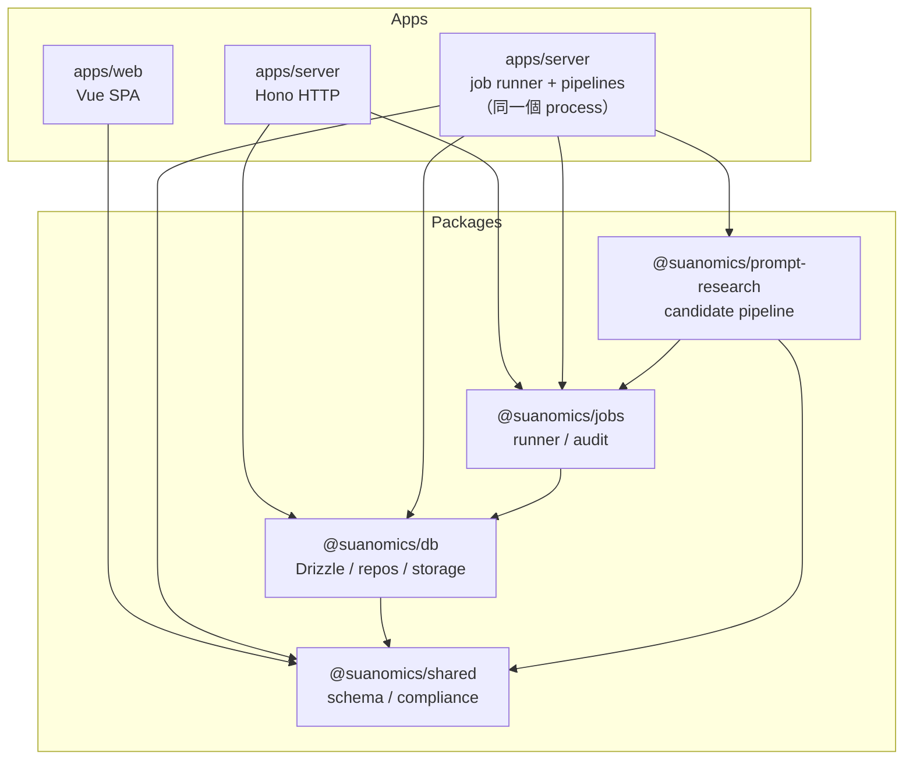
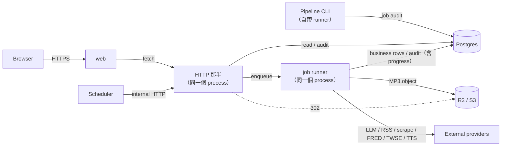

# 模組地圖（Module Map）

> 本頁描述目前各 workspace 的 ownership、public surface、依賴方向與 runtime 接縫。執行細節見 [Runtime Flows](runtime-flows.md)，LLM 角色與 prompt 契約見 [Agents 與 Prompts](agents-and-prompts.md)。

- 上層脈絡：[系統概覽](system-overview.md)

## TL;DR

- **2 個 app**：`apps/web` 是 Vue SPA；`apps/server` 一個 process 兼兩件事——同步 HTTP／enqueue 邊界，以及 job runner／LLM／外部整合執行端（2026-09-04 由兩個 process 合併而來）。
- **4 個 package**：`@suanomics/shared` 管契約，`@suanomics/db` 管持久資料，`@suanomics/jobs` 管 async job，`@suanomics/prompt-research` 管 prompt candidate pipeline。
- HTTP 那半與 job 那半在同一個 process，但仍不直接互 call：HTTP 只呼叫 runner 的 `enqueue`，狀態與結果索引一律透過 Postgres `background_jobs` 對接。
- 兩半共用 `@suanomics/db`，但 ownership 以「HTTP 讀取／enqueue、handler 產製／寫入」為主。
- ESLint 以 `import-x/no-restricted-paths` 阻擋 app 橫向 import 與 package 反向依賴 app。

## Workspace 一覽

| Workspace | Type | 部署目標 | 一句話職責 |
|---|---|---|---|
| [`apps/web`](../../apps/web/package.json) | app | `Dockerfile.web`（同上） | Vue 3、Pinia、Vue Router；渲染 Daily Brief、單則分析、ad-hoc job 與 podcast |
| [`apps/server`](../../apps/server/package.json) | app | `Dockerfile.server`（主機未定，參考 compose 見 [deploy](../operations/deploy.md)） | Hono HTTP 邊界（public read、internal enqueue、job polling、audio delivery）＋八個 job handler、業務 pipeline、LLM agents、第三方 provider 與 CLI |
| [`packages/shared`](../../packages/shared/package.json) | lib | — | 共用 Zod schema、business types、citation 與 compliance helper |
| [`packages/db`](../../packages/db/package.json) | lib | — | Drizzle schema、Postgres client／repos、migration、local 與 S3-compatible audio storage |
| [`packages/jobs`](../../packages/jobs/package.json) | lib | — | Job payload schema、in-process runner、payload-hash dedupe、audit repo |
| [`packages/prompt-research`](../../packages/prompt-research/package.json) | lib | — | Prompt distill／merge／compile runtime；輸出 candidate 後由人工 promote |

Workspace 名稱統一連到各自的 `package.json`，用來確認 workspace identity、scripts、dependencies 與 exports；active runtime surface 仍以本頁末的 entrypoint、route 與 registry 連結為準。

## 依賴方向

邊界規則：

1. `apps/*` 之間不能互相 import；跨 app 溝通只能走 HTTP、database 或共用 package。
2. `packages/*` 不能依賴 `apps/*`；package 必須可由上層 consumer 明確注入或呼叫。
3. `@suanomics/shared` 是 internal dependency graph 的葉節點；`@suanomics/db` 只向下依賴 `@suanomics/shared`。
4. route input 目前以 route-local Zod 或 `@suanomics/jobs` payload schema 驗證；`@suanomics/shared` 只在 route 需要共用判定時直接用（例如 `ops.ts` 的 `checkStartupConfig`）。
5. `@suanomics/shared` 的 exports 指向 `dist`；改 schema 後應先 build，再驗證 consumer。

## Runtime 拓樸

HTTP 與 job 執行 2026-09-04 起在同一個 process，但職責仍分開：route handler 不執行 job，job handler 不提供 public HTTP。完整的 sync、async、daily、news、market-data、prompt research 與 audio sequence 由 [Runtime Flows](runtime-flows.md) 維護，本頁不複製其 retry 與降級分支。

## Apps：對外 surface

### `apps/web`

**Entrypoint**：`apps/web/src/main.ts`；router 在 `apps/web/src/router/index.ts`。

| Route | View / behavior | Output |
|---|---|---|
| `/` | `HomeView.vue` | 最新 Daily Brief；閱讀／podcast 模式 |
| `/d/:date` | `HomeView.vue` | 指定日期 Daily Brief |
| `/brief` | redirect 到 `/` | 舊連結相容 |
| `/brief/news/:id` | lazy `BriefNewsView.vue` | 單則新聞分析 |
| `/brief/analyze` | lazy `BriefAnalyzeView.vue` | ad-hoc 分析表單、進度與結果 |

Web 使用原生 `fetch`，base URL 由 `VITE_API_URL` 決定。`stores/brief.ts` 讀 daily、by-date、dates 與 news endpoints；`composables/useAnalyzeJob.ts` 提交 analyze、輪詢 job，再讀 analysis。Web 不直接呼叫 LLM、Postgres、R2 API 或外部資料源。

### `apps/server`：HTTP 那半

**組裝點**：`apps/server/src/http/app.ts` 的 `createApp()`（entry 是 `src/index.ts`，它同時起 HTTP 與 job runner）。目前 mounts 是 `/`（health 與 audio）、`/api`（brief、market、ops）、`/api/jobs`（polling）、`/internal`（受保護 enqueue）。

| 區段 | Method | Path | 功能 |
|---|---|---|---|
| public | GET | `/` | text health check |
| public | GET | `/health` | structured health，附 runner 的 per-kind 佇列統計 |
| public | GET | `/api/brief/daily` | 最新 Daily Brief |
| public | GET | `/api/brief/dates` | 可讀取的 brief 日期清單 |
| public | GET | `/api/brief/by-date/:date` | 指定日期 Daily Brief |
| public | GET | `/api/brief/news/:id` | 單則新聞與最新 analysis |
| public | GET | `/api/brief/analyses/:id` | ad-hoc analysis result |
| public | POST | `/api/brief/analyze` | 驗證輸入並 enqueue `analyze` |
| public | GET | `/api/jobs/:jobId` | 讀 Postgres audit（狀態與 `metadata.progress` 同一筆 row） |
| public | GET | `/audio/podcast/:filename` | local stream 或 302 到 R2 public URL |
| internal | POST | `/internal/corpus/refresh` | enqueue `corpus-refresh` |
| internal | POST | `/internal/brief/enqueue` | enqueue `daily-brief` |
| internal | POST | `/internal/news/refresh` | enqueue `news-refresh` |
| internal | POST | `/internal/podcast/generate` | enqueue `podcast-generate` |
| internal | POST | `/internal/podcast/tts` | enqueue `podcast-tts` |
| internal | POST | `/internal/prompt-research/refresh` | enqueue `prompt-refresh` |
| internal | POST | `/internal/market-data/refresh` | enqueue `market-data-refresh` |

`/internal/*` 在非 development 環境要求 `INGEST_TRIGGER_SECRET` Bearer token。route handler 只寫 job audit／enqueue，不呼叫 LLM、也不 scrape——那些發生在同 process 的 job handler 那半。

### `apps/server`：job 那半

**Entrypoint**：`apps/server/src/index.ts`。`createServerRunner()` 在**同一個** Node.js process 建立一個 runner，八個 kind 各有自己的佇列與併發（與上面的 HTTP server 同 process）；concurrency 可由表列 env override。

| Job kind | Handler | 預設 concurrency | 重要行為 |
|---|---|---:|---|
| `corpus-refresh` | `corpus-worker.ts` | 2 | 更新 external corpus；兩日一次的排程由部署者自備、打 internal endpoint |
| `analyze` | `analyze-worker.ts` | 1 | 產出 analysis；支援 ad-hoc 與 daily 預熱 |
| `daily-brief` | `brief-worker.ts` | 1 | 選稿、storylines、market context、分析與報告；通常 chain podcast |
| `podcast-generate` | `podcast-generate-worker.ts` | 1 | 寫入文稿；fresh success chain `podcast-tts` |
| `podcast-tts` | `podcast-tts-worker.ts` | 1 | 合成 MP3、存 storage、更新 DB path |
| `news-refresh` | `news-refresh-worker.ts` | 2 | 新聞 ingest／scrape／分類／標籤 |
| `prompt-refresh` | `prompt-refresh-worker.ts` | 1 | distill／compile candidate |
| `market-data-refresh` | `market-data-refresh-worker.ts` | 1 | 抓 FRED／TWSE／TAIFEX／Nasdaq 並 upsert market data |

Env overrides 依序為 `CORPUS_REFRESH_CONCURRENCY`、`ANALYZE_CONCURRENCY`、`DAILY_BRIEF_CONCURRENCY`、`PODCAST_GENERATE_CONCURRENCY`、`PODCAST_TTS_CONCURRENCY`、`NEWS_REFRESH_CONCURRENCY`、`PROMPT_REFRESH_CONCURRENCY`、`MARKET_DATA_REFRESH_CONCURRENCY`。

`jobs/handlers/*` 是 runner 與業務 pipeline 之間的薄殼（回傳 `resultRef` 與 metadata，audit lifecycle 由 runner 負責）；可重用業務 pipeline 位於 `brief/`、`corpus/`、`news/`、`market-data/`、`podcast/`、`podcast-tts/`、`prompt-research/`。LLM runtime、prompt 與 provider 詳情只在 [Agents 與 Prompts](agents-and-prompts.md) 維護。

**量測程式碼只有一個家：`eval/`。** judge 與 pairwise、canary ablation、trend log、claim／ledger 指標、model-ab 的分析原語與報告，全部住這裡。`tools/cli/` 是 CLI 入口，`tools/cli/lib/` 只放 CLI 自己的零件——旗標解析（`smoke-args.ts`）、輸出路徑（`claim-yield-output-path.ts`）、job 執行骨架（`run-job-cli.ts`）。判準是「拿掉 CLI 之後這段還有沒有意義」：有，就進 `eval/`。

這條規則是 2026-08-14 補的。在那之前兩邊都住了量測模組，界線是時間而不是概念——`eval/` 是 2026-06-13 到 08-03 的家，之後新增的量測模組落到 CLI 的 `lib/`（現在的 `tools/cli/lib/`），而 model-ab 剛好建在交界那天、被切成兩半。

## Packages：對外 surface

### `@suanomics/shared`

- `market-brief.ts`：`MarketBriefSchema`、cascade／narrative／citation 契約。
- `podcast.ts`：Podcast structured output 契約。
- `compliance.ts`：禁用語與 compliance helpers。
- Runtime dependency 只有 Zod；Web、server、DB 與 prompt research 依自己的邊界取用。

### `@suanomics/db`

- `schema.ts` 定義新聞來源／項目、analyses、Daily Brief、external corpus、background jobs、market data 與 storylines 等表。
- `repos/*` 依領域提供 analyses、articles、news、market data、storylines 的查詢與寫入，不用固定數字描述 repo 數量。
- `client.ts` 建立 Postgres connection；production deployment 由容器 entrypoint 在啟動 server 之前跑 migration。
- `storage/*` 提供 podcast audio interface、格式常數、local filesystem 與 S3-compatible implementation。

### `@suanomics/jobs`

- `JOB_KINDS` 與 `PAYLOAD_SCHEMA_BY_KIND` 是八種 job 的 registry。
- `createJobRunner()` 的 `enqueue` 先做 Zod parse、stable payload hash 與 Postgres audit，再推進該 kind 的記憶體佇列；同 kind payload 可回既有 inflight／completed 結果。
- runner 也負責 retry／backoff、per-kind 併發、progress 寫入與 `drain()`／`stop()`。
- `createAuditRepo()` 管 `background_jobs` lifecycle，包含開機時的 `failAllInflight()`。

### `@suanomics/prompt-research`

- 接受 skill Markdown、custom text、YouTube 或 podcast RSS source，執行 light／deep distill、merge 與 compile。
- `prompt-refresh` handler 與 local CLI 會使用此 package；HTTP route 與 Web 不 import。
- 輸出是 filesystem candidate，不自動改 production prompt；人工 review／promote 才能進入 `apps/server/src/prompts/*.prompt.ts`。

## Storage 與資料 ownership

| Resource | 寫入者 | 主要內容 | 讀取者／交付方式 |
|---|---|---|---|
| Postgres | job handler；HTTP／CLI 經 `@suanomics/jobs` 寫 audit | news、external articles、analyses、Daily Brief、jobs（含 progress）、market data、storylines | HTTP 同步查詢與 job polling；handler 載入 context |
| server process 記憶體 | runner | 等待中／執行中的 job、backoff 計時、per-kind 併發 | 只有這個 process 自己；重啟即歸零，開機時 `failAllInflight()` 清帳 |
| Local filesystem | job handler／local CLI | 開發環境 podcast MP3、prompt candidate | 單一 process 內讀寫同一份 filesystem；水平擴容成多容器時就不成立 |
| R2 / S3-compatible storage | job handler | production podcast MP3 | `/audio` 回 302；R2 public URL 提供 bytes／404 |

Local filesystem 是 ephemeral、只適合 local dev 或明確的 shared filesystem。水平擴容成多個容器時各自有獨立 filesystem，不能假設彼此看得到對方的本機檔案，因此 production audio 使用 R2。S3 mode 下 `/audio` 不持有讀取 object 的 credentials，也不先做 HEAD；它依日期組 canonical public URL 並回 302。`PODCAST_STORAGE_KIND` 怎麼選、打錯字會發生什麼事，見[環境設定](configuration.md)。

## Runtime lifecycle 接縫

| Flow | Web／trigger | HTTP boundary | Job | Result／backing store |
|---|---|---|---|---|
| Daily report read | `/`、`/d/:date` | `GET /api/brief/daily`、`by-date`、`dates` | 不經 job | 讀取 Postgres `daily_briefs`／`news_items`；音檔 URL 指向 R2 |
| Ad-hoc analyze | `/brief/analyze` | `POST /api/brief/analyze` + `GET /api/jobs/:jobId` | `analyze` handler | Postgres `analyses` + `background_jobs` audit |
| Daily production | scheduler 或 CLI | scheduler：`/internal/brief/enqueue`；CLI：不經 API | `daily-brief` handler → optional podcast chain | Postgres Daily Brief／storylines／podcast JSON；R2 MP3 |
| Data refresh | scheduler 或 CLI | scheduler：對應 `/internal/*/refresh`；CLI：不經 API | `news-refresh`／`corpus-refresh`／`market-data-refresh`／`prompt-refresh` handler | News／corpus／market data 寫 Postgres；prompt candidate 是 filesystem artifact，無 persistent volume 時為 ephemeral |

這張表只標 ownership 與接縫；dedupe、retry、parent／child failure、partial success 與完整序列統一以 [Runtime Flows](runtime-flows.md) 為準。

## 命名與邊界紀律

| 紀律 | 強制機制 |
|---|---|
| apps 不互相 import；packages 不依賴 apps | ESLint `import-x/no-restricted-paths` zones |
| source file 不超過 300 行 | ESLint `max-lines` error；test files 豁免 |
| function 超過 80 行提醒 | ESLint `max-lines-per-function` warning |
| agent 的 system prompt 集中於 `src/prompts/` | `apps/server/src/agents/<name>.ts`（runner） + `apps/server/src/prompts/<name>.prompt.ts`（prompt）慣例 |
| production prompt 不由 candidate 自動覆寫 | 人工 review／promote gate |

## Source of Truth

- API mounts／routes：[`apps/server/src/http/app.ts`](../../apps/server/src/http/app.ts)、[`apps/server/src/http/routes/`](../../apps/server/src/http/routes/)
- Web routes／data access：[`apps/web/src/router/index.ts`](../../apps/web/src/router/index.ts)、[`apps/web/src/stores/`](../../apps/web/src/stores/)、[`apps/web/src/composables/`](../../apps/web/src/composables/)
- Job registry／handlers：[`apps/server/src/jobs/create-server-runner.ts`](../../apps/server/src/jobs/create-server-runner.ts)、[`apps/server/src/jobs/handlers/`](../../apps/server/src/jobs/handlers/)
- Job registry：[`packages/jobs/src/types.ts`](../../packages/jobs/src/types.ts)
- Database／storage：[`packages/db/src/schema.ts`](../../packages/db/src/schema.ts)、[`packages/db/src/repos/`](../../packages/db/src/repos/)、[`packages/db/src/storage/`](../../packages/db/src/storage/)
- Workspace deps／exports：各 workspace `package.json`；import zones：[`eslint.config.js`](../../eslint.config.js)

若本頁與歷史 spec 或 README 不一致，先以 active entrypoint、mount、registry、schema 與 caller 判定現況，再更新對應文件。
