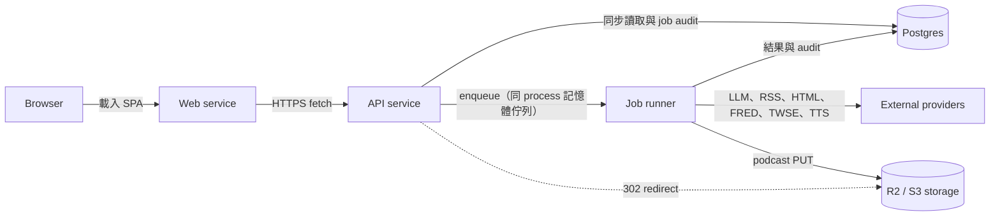
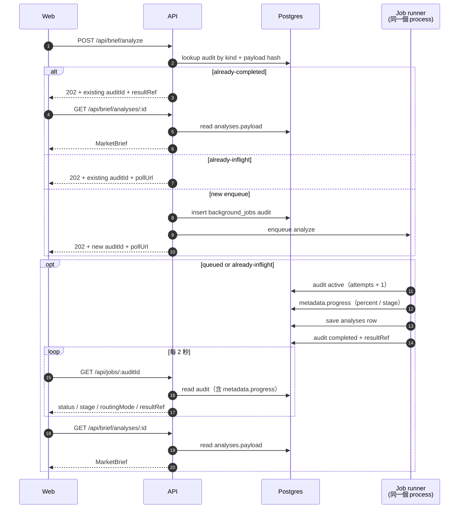
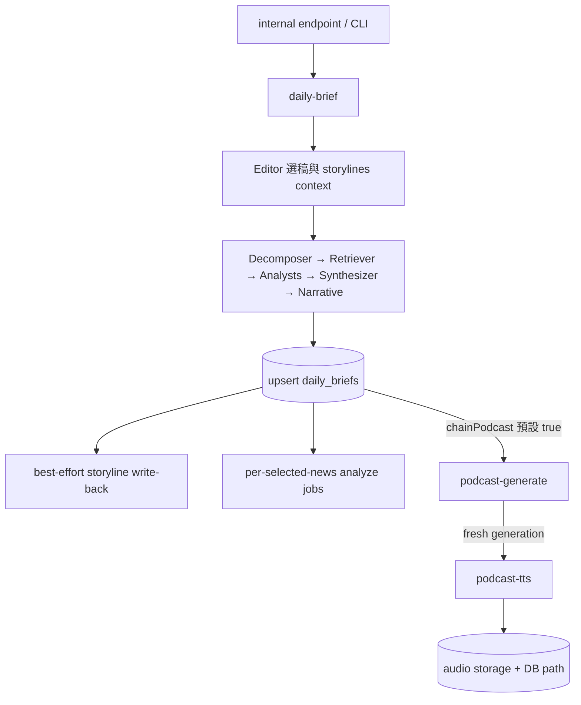

# Runtime Flows

本頁描述目前程式碼實際執行的同步讀取、非同步 job、資料落地與降級路徑。若要先看 workspace 邊界與依賴方向，見 [模組地圖](module-map.md)；若要追 LLM agent、prompt 與模型呼叫，見 [Agents 與 Prompts](agents-and-prompts.md)。

## 先建立心智模型

整套系統有三條清楚的 runtime 邊界：

- HTTP 那半接請求、驗證輸入、讀 Postgres、建立 audit 與 enqueue；**不執行 LLM，也不 scrape 外站**。
- job 那半由同一個 process 內的 runner 執行，呼叫 LLM／外部資料源、寫永久結果；**不提供 public HTTP**。
- Web 只透過 HTTP API 讀資料、提交任務與輪詢，不直接連 Postgres 或外部 provider。

兩半在同一個 process 裡，但仍不直接互相呼叫：HTTP 那半只會 `enqueue`，之後誰在跑、跑到哪，一律看 Postgres 的 `background_jobs`——狀態、`attempts`、進度與 `resultRef` 全在同一筆 row。真正的分析、報告、新聞與市場資料也落在 Postgres。這是 2026-09-04 的改動要換掉的東西：以前狀態有兩份（佇列一份、audit 一份），對不上的時候沒有人是對的。

## Runtime Deployment Topology

瀏覽器先載入 Web，再以 `VITE_API_URL` 呼叫 server。同步讀取直接查 Postgres；長任務先寫 audit row、再推進同一個 process 的 runner，由它寫回結果。上圖是部署使用的 S3/R2 路徑：server 只組 public URL 並回 302，音檔內容由 R2 提供。`LocalPodcastStorage` 只保留給 local dev 與向後相容。

server 另提供 `/health`（含 runner 的 per-kind 佇列統計）與 `/`。`/internal/*` 在 development 以外要求 `Authorization: Bearer <INGEST_TRIGGER_SECRET>`，作為外部 scheduler 或維運觸發入口。

## 同步讀取流程

Web 目前有 `/`、`/d/:date`、`/brief`（redirect 到 `/`）、`/brief/news/:id`、`/brief/analyze` 五條 route。讀取資料時由 `brief` store 使用原生 `fetch`：

| 使用情境 | API | Postgres 查詢與回應 |
|----------|-----|--------------------|
| 最新報告 | `GET /api/brief/daily` | 取最新 `daily_briefs`，再以 `selectedNewsIds` 取 `news_items`；若已有音檔路徑，附上 API audio URL |
| 指定日期報告 | `GET /api/brief/by-date/:date` | 驗證 `YYYY-MM-DD`、取當日 `daily_briefs` 與選中新聞；無資料回 `{ brief: null, items: [] }` |
| 可選日期 | `GET /api/brief/dates` | 依日期倒序讀出所有 `daily_briefs.briefDate` |
| 單則新聞 | `GET /api/brief/news/:id` | 取 `news_items` 與該新聞最新一筆 `analyses`；尚無分析時 `analysis` 為 `null` |
| 分析結果 | `GET /api/brief/analyses/:id` | 依 `resultRef` 中的 id 取 `analyses.payload` |
| Podcast 音檔 | `GET /audio/podcast/:filename` | 驗證日期與副檔名；local storage 由 API 讀檔回 audio，S3 storage 回 302 到 public URL |

`fetchDaily()` 與 `fetchByDate()` 共用同一份 report state；日期清單讀取失敗會靜默保留主報告。後端回傳的 audio path 是相對路徑，store 會加上 `API_BASE`，因為 Web 與 API 可部署在不同網域。

## 非同步 Job 共用生命週期

一般經 runner 的 `enqueue()` 進入的 job 會走以下流程：

1. 以 Zod schema 解析 payload，包含 default 欄位，再計算 payload hash。去重 key 是 `(kind, payloadHash)`。
2. 先查同 kind、同 hash 的 `background_jobs`。仍在該 kind 執行時間窗內的 `queued`／`active` 直接回 `already-inflight`（窗見 `JOB_INFLIGHT_STALENESS_MS`）；24 小時內完成的結果直接回 `already-completed` 與既有 `resultRef`。
3. 新工作先 insert `background_jobs`，再推進該 kind 的記憶體佇列。insert 失敗會向外 throw，HTTP 呼叫端拿到 `enqueue_failed`，不會留成假性 inflight。
4. runner 每次執行前把該 audit row 標 `active` 並遞增 `attempts`；handler 透過 `ctx.updateProgress()` 寫 `metadata.progress`；成功時寫永久結果並標 `completed`、附 `resultRef` 與 metadata。
5. `GET /api/jobs/:auditId` 完全讀 Postgres audit：`active` 時的 percent／stage 來自同一筆 row 的 `metadata.progress`，沒寫過就回 0。

runner 預設最多嘗試 3 次、5 秒起跳的 exponential backoff（`JOB_RETRY_DEFAULTS`）。**中途 attempt 失敗不寫 audit**，只有最後一次失敗才標 `failed`——所以輪詢方在重試期間看到的是 `active`，不是 `failed`。backoff 期間不佔用該 kind 的併發額度，後面排隊的 job 照跑。

兩日一次的 corpus refresh 不在 process 內排程：由部署者自備的外部排程打 `POST /internal/corpus/refresh`，所以與其他 job 一樣有 audit row、查得到、能觀測。

| Job kind | 觸發入口 | Handler | Concurrency default | 永久輸出 | 後續 chain |
|----------|----------|---------|---------------------|----------|------------|
| `corpus-refresh` | `POST /internal/corpus/refresh`（含部署者自備的兩日外部排程）、`corpus:refresh` CLI | `runCorpusRefresh`（`corpus-worker.ts`） | 2 | `external_articles`；audit `resultRef=external_articles/batch-<auditId>` | 無 |
| `analyze` | `POST /api/brief/analyze`、daily brief 對每則 selected news 的預跑 | `runAnalyze`（`analyze-worker.ts`） | 1 | `analyses`；`resultRef=analyses/<id>` | 無 |
| `daily-brief` | `POST /internal/brief/enqueue`、`brief:generate` CLI | `processBriefJob`（`brief-worker.ts`） | 1 | `daily_briefs`；`resultRef=daily_briefs/<id>` | 每則 selected news enqueue `analyze`；通常 enqueue `podcast-generate` |
| `podcast-generate` | `POST /internal/podcast/generate`、daily chain、`podcast:generate` CLI | `processPodcastGenerateJob` | 1 | `daily_briefs.podcastJson`；`resultRef=daily_briefs/<date>/podcast_json` | 新產生成功時 enqueue `podcast-tts`；既有內容 skip 時不 enqueue |
| `podcast-tts` | `POST /internal/podcast/tts`、podcast chain、`podcast:tts` CLI | `processPodcastTtsJob` | 1 | 音檔與 `daily_briefs.podcastAudioPath`；`resultRef=daily_briefs/<date>/podcast_audio` | 無 |
| `news-refresh` | `POST /internal/news/refresh`、`news:refresh` CLI | `processNewsRefreshJob` | 2 | `news_items`；`resultRef=news_items/refresh-<auditId>` | 無 |
| `prompt-refresh` | `POST /internal/prompt-research/refresh`、`prompt:refresh` CLI | `processPromptRefreshJob` | 1 | Filesystem `packages/prompts/_candidates/<runId>`；audit `resultRef=prompts/_candidates/<runId>`；不寫 DB 結果表 | 無 |
| `market-data-refresh` | `POST /internal/market-data/refresh`、`market-data:refresh` CLI | `processMarketDataRefreshJob` | 1 | `market_data_points`；`resultRef=market_data/refresh-<auditId>` | 無 |

Concurrency 都可由對應的 `*_CONCURRENCY` env 覆寫（`apps/server/src/jobs/specs.ts`）。

## Ad-hoc Analyze

API 接受 `newsItemId`，或 ad-hoc 的 `title + content`；若是 id path，API 先從 `news_items` 補齊標題、內容與 URL，再交給 runner 的 `enqueue`。Route 對三種成功狀態都回 202：`queued` 是新任務已接受，`already-inflight` 要沿用既有 audit polling，`already-completed` 則直接沿用既有結果。

handler 先決定 routing mode，並在仍是 `active` 時把決策寫入 audit metadata：

- `cache-hit`：同 input hash 有尚未過期的分析，重用 payload，但仍寫一筆新的 `analyses` row。
- `db-related`：至少兩個 canonical entities，且近 7 天 cached analyses 有至少一筆達 60% entity overlap；略過完整拆解與外部搜尋，以既有鄰近結果輔助 analyst。若此路徑失敗，改走 `full-pipeline`。
- `gap-scrape`：有足夠 entities 但沒有達門檻的 cached neighbor；以 `external_articles` 的 alias-expanded 查詢與弱相關 DB 結果合併去重後分析。（2026-08-21 前這裡還會併入 Firecrawl search 的結果，已移除——它讀錯回應欄位，送進來的是沒有內文的 URL。）
- `full-pipeline`：entities 不足，或 `db-related` fallback；執行 decomposer、DB retriever 與 analyst pipeline。

`useAnalyzeJob` 每 2 秒 poll 一次，client 最多等待 120 秒。Poll 遇到暫時網路錯誤或非 404 的非成功回應，會在下一個 tick 重試；404、明確 `failed` 或結果讀取失敗才結束。`cancel()` 只 abort 瀏覽器等待與 polling，**不會取消已經排進 runner 的 job**；它仍會跑完並保存結果，之後相同輸入可能直接命中 cache。

若 POST 當下已取得 `already-completed + resultRef`，Web 不進 polling，直接讀 analysis；這是 enqueue 的 payload-hash reuse，與 handler 內部 `cache-hit` routing 是不同層次的快取。

## Daily Brief Production Chain

Daily job 先從候選新聞、open storylines、近期報告與 market context 組成 Editor 輸入。Editor 或其前置讀取失敗時，選稿回退到 recency selection；market snapshot／行事曆失敗時以 `null` 繼續。每則新聞的 decomposer 與 analyst 採 partial-success：失敗項目會被排除並記入 metadata，但存活數低於最低門檻時整個 job 仍失敗。

主 pipeline 完成後，以 `briefDate` upsert `daily_briefs`，保存 selected ids、summary 與完整 `briefJson`。永久報告已保存後才 best-effort 寫回 `storylines`，並逐則 enqueue `analyze` 預熱；任何單則 enqueue 失敗不回滾報告。`chainPodcast` 預設為 true，podcast child enqueue 失敗也只記 warning。也就是 parent 已完成的結果不會因 fire-and-forget child enqueue 失敗而被丟棄。

## News Refresh

`news-refresh` 讀取啟用的 `news_sources`，逐來源抓 RSS、parse 並以 external id 去重，再把新項目寫入 `news_items`。新項目會以受限 concurrency 抓文章 HTML、抽出正文後更新 `contentText`；單篇 scrape 回傳空值時保留 RSS 內容，不讓整個來源失敗。

feed host 是 `news.google.com` 的來源（`isGoogleNewsProxySeed` 判準）整批跳過抓正文：這批來源的 `<link>` 是轉址頁，抓那一頁本身就拿不到正文，讀者拿到的是標題與轉址連結。跳過的則數記在 `perSource[].feedSkipped`，不算進 `sourcesFailed`——這是這批來源的既定狀態，不是抓取失敗。

每個來源完成 insert 後，Worker 以 LLM 批次執行 categorizer 與 tagger。兩者都是非阻擋加值：categorizer 失敗時 `category` 保持 `null`、下游退回來源層分類；tagger 失敗時維持未標狀態、下游退回 alias 邏輯。單一來源 RSS 或 DB 流程失敗也只記入 `sourcesFailed`，其他來源繼續。

## Corpus Refresh

`corpus-refresh` 與新聞 ingest 是不同資料域。它讀 `external_sources` 的 enabled rows，先以 schema 驗證 `rss`、`official-feed` 或 `html-selector` config，再由 dispatcher 直接抓來源。無效 config 被跳過；單一來源 fetch 失敗會列入 `failedSources`，不阻擋其他來源。

每篇文章先 canonicalize URL，以 `sourceId + urlHash` 避免重複；若 content hash 已有 enrichment，重用既有 summary／entities／topic tags。否則呼叫 Gemini enrichment。Enrichment 失敗時仍保存原始文章，只把 enrichment 欄位留空並累計失敗數。結果寫入 `external_articles`，供 Daily Brief retriever 與 Analyze routing 查詢。

## Market Data Refresh

`market-data-refresh` 從 FRED、TWSE、TAIFEX 與 Nasdaq（`api.nasdaq.com`、美股指數）抓定義於 `SERIES_SPECS` 的原始序列，套用 level、YoY 或 MoM difference transform，再以 `(seriesId, date)` upsert `market_data_points`。FRED 缺 API key 時只讓 FRED series 進入 failures，其他來源仍可繼續。

每條 direct series 各自 catch；10Y-2Y spread 等 derived series 最後從 DB 已落地的兩腿計算，因此本次某腿抓取失敗時仍可能使用既有值。Job 回報所有 failures，但其他成功點不回滾。Daily Brief 的 market context 只讀最新資料；snapshot 或經濟行事曆任何一側失敗都各自降級成 `null`。

## Prompt Research Refresh

`prompt-refresh` 使用 payload 指定 sources，未指定時採 `DEFAULT_SOURCES`。Source 可來自 skill Markdown、自訂文字、YouTube 字幕或 podcast RSS；逐來源 dispatch 與 distill，之後在記憶體 merge digests、寫 merged draft，再 compile 成 candidate `.system.ts` 檔。

Filesystem 輸出位於 `packages/prompts/_candidates/<runId>`，並只保留最近 10 個 run；audit 的精確 `resultRef` 是 `prompts/_candidates/<runId>`。這些檔案的 durability 取決於部署是否提供持久化 storage，不能視為 Postgres 等級的永久結果。這條 flow 不寫 Postgres 業務結果，且不會自動 promote candidate。深度影音／音訊來源會經 Gemini 處理；任何 source 或 compile error 會讓 job 失敗，不採 corpus 那種 per-source partial success。

## Podcast Generate、TTS 與 Audio Delivery

`podcast-generate` 先讀當日 `daily_briefs.briefJson`。已有 `podcastJson` 且 `force=false` 時 idempotently skip；否則驗證 `MarketBrief`，best-effort 載入 calendar 與當日 touched storylines，呼叫 PodcastWriter，最後寫回 `daily_briefs.podcastJson`。只有 freshly generated 的成功結果會 enqueue `podcast-tts`；skip 不會補 enqueue。

`podcast-tts` 先讀 `daily_briefs`。只要 `podcastAudioPath` 已存在就直接 skip，避免 retry 重複付費合成；否則驗證 `podcastJson`。`PODCAST_TTS_PROVIDER=azure` 使用 Azure Speech，其餘值使用 Gemini TTS。Gemini 逐段合成 PCM、串接後 encode MP3；Azure 以整集文字取得 MP3。保存音檔成功後才更新 `podcastAudioPath` 與生成時間。

Delivery 有兩種實作：

- `LocalPodcastStorage`：僅供 local dev 與向後相容，檔案是 ephemeral；只有寫入與讀取共用同一 filesystem 時（單一容器成立、水平擴容不成立），讀取端才能驗證檔名、確認存在、讀檔並回 `audio/mpeg`。水平擴容成多個容器時各自有獨立 filesystem，因此不能用這條路徑交付跨容器音檔。
- `S3PodcastStorage`：`podcast-tts` handler 以 signed PUT 寫入 R2/S3-compatible bucket；`/audio` 不讀 object，也不檢查存在，只對 canonical public URL 回 302，缺檔由 object storage 回 404。

## Postgres 資料所有權

| Table | 內容 | 主要 writer | 主要 reader | 永久結果／暫態狀態 |
|-------|------|-------------|-------------|---------------------|
| `news_sources` | 新聞 RSS 來源、slug、啟用狀態 | DB seed／維運資料 | `news-refresh` Worker | 永久來源設定 |
| `news_items` | 新聞 metadata、RSS／scrape 內容、category、topic tags | `news-refresh` Worker | API report／news routes、Daily Brief Worker、Analyze Worker | 永久 ingest 結果 |
| `analyses` | `MarketBrief` payload、input hash、entities、cache expiry | Analyze Worker | API analysis／news routes、Analyze routing | 永久分析結果；expiry 只控制 cache eligibility |
| `daily_briefs` | 當日選稿、summary、完整 brief、podcast、audio path | Daily Brief、Podcast Generate、Podcast TTS Workers | API report routes、Podcast Workers、Editor context | 永久報告與 podcast 結果 |
| `external_sources` | corpus source kind、tier、config、enabled | DB seed／維運資料 | Corpus Worker | 永久 corpus 來源設定 |
| `external_articles` | canonical article、摘要、entities、topic tags、LLM metadata | Corpus Worker | Daily Brief retriever、Analyze Worker | 永久 corpus 結果 |
| `background_jobs` | job kind、payload hash、status、attempts、metadata（含 progress）、`resultRef` | HTTP 那半與 runner，都經 `@suanomics/jobs` | Job polling API、enqueue dedupe、開機回收 | job 狀態的唯一真相，兼稽核紀錄 |
| `market_data_points` | transform 後的時間序列值 | Market Data Refresh Worker | Daily Brief market context、derived series 計算 | 永久市場資料 |
| `storylines` | 跨日敘事線、狀態、entities、updates | Daily Brief Worker 的 Editor write-back | Daily Brief Editor、Podcast Generate Worker | 永久跨日敘事狀態 |

## Postgres 與 R2 的責任分工

| Infrastructure | 負責 | 不負責 |
|----------------|------|--------|
| Postgres | `background_jobs` 的狀態、attempts、progress、payload dedupe 查詢、`resultRef`，以及新聞／分析／報告／市場資料／storylines | 大型 podcast binary |
| server process 記憶體 | 等待中與執行中的 job、retry backoff 計時、per-kind 併發 | 任何需要跨重啟存活的東西 |
| R2 / S3-compatible storage | Podcast MP3 object 與 public delivery | Job 狀態、報告 JSON、Web/API 協調 |

記憶體那一列的代價要講清楚：process 一重啟，排隊中與執行中的 job 就沒了。開機時 `failAllInflight()` 會把所有 `queued`／`active` row 無條件標成 `failed`，靠下一次觸發補——留著它們只會讓同 payload 被當成 `already-inflight` 擋住。`background_jobs.resultRef` 只是指標，不包含分析 payload 或音檔本身。

## Retry、Idempotency 與 Graceful Degradation

- **Job retry**：runner 預設 3 attempts、5 秒起跳的 exponential backoff；失敗訊息最多保存 2,000 字元。中途 attempt 失敗不寫 audit，只有最後一次才標 `failed`，所以輪詢方在重試期間看到的是 `active`。
- **Enqueue idempotency**：去重 key 是 kind + normalized payload hash；inflight reuse 與 24 小時 completed reuse 兩種狀態各自處理。
- **Daily idempotency**：`daily_briefs.briefDate` unique，產出採 upsert；child enqueue 是 best-effort，不回滾 parent。
- **Podcast idempotency**：既有 `podcastJson` 在未 force 時 skip；既有 `podcastAudioPath` 讓 TTS skip。
- **Corpus idempotency**：source + canonical URL hash unique；content hash 可重用 enrichment。
- **Market idempotency**：`seriesId + date` unique 並 upsert。
- **Client cancellation**：只停止 Web 等待，不撤銷後端工作。
- **Non-blocking failures**：Editor 失敗回退 recency selection；market context 各區塊降級 `null`；storyline write-back、每則 news analyze enqueue 與 podcast child enqueue 只 warning；News categorizer／tagger 失敗保留未加值資料。
- **Partial success**：News Refresh 與 Corpus Refresh 可略過單一來源；Market Data Refresh 可保留成功 series；Daily agent fanout 可略過個別新聞，但仍受最低存活數 gate 約束。

## Source of Truth

本頁以 runtime code 為準；若表格或圖與程式不一致，應先更新實作或本頁，不要從舊 phase 文件推回目前行為。主要入口如下：

- API mount 與同步 routes：[`apps/server/src/http/app.ts`](../../apps/server/src/http/app.ts)、[`brief.ts`](../../apps/server/src/http/routes/brief.ts)、[`jobs.ts`](../../apps/server/src/http/routes/jobs.ts)、[`internal.ts`](../../apps/server/src/http/routes/internal.ts)、[`audio.ts`](../../apps/server/src/http/routes/audio.ts)
- Web route／讀取／polling：[`router/index.ts`](../../apps/web/src/router/index.ts)、[`stores/brief.ts`](../../apps/web/src/stores/brief.ts)、[`useAnalyzeJob.ts`](../../apps/web/src/composables/useAnalyzeJob.ts)
- Job registry 與八個 handler：[`apps/server/src/jobs/create-server-runner.ts`](../../apps/server/src/jobs/create-server-runner.ts)、[`specs.ts`](../../apps/server/src/jobs/specs.ts)、[`apps/server/src/jobs/handlers/`](../../apps/server/src/jobs/handlers/)
- Runner、job contract 與 audit：[`packages/jobs/src/runner.ts`](../../packages/jobs/src/runner.ts)、[`runner-types.ts`](../../packages/jobs/src/runner-types.ts)、[`types.ts`](../../packages/jobs/src/types.ts)、[`audit.ts`](../../packages/jobs/src/audit.ts)
- DB 與 audio storage：[`packages/db/src/schema.ts`](../../packages/db/src/schema.ts)、[`podcast-storage.ts`](../../packages/db/src/storage/podcast-storage.ts)、[`s3-podcast-storage.ts`](../../packages/db/src/storage/s3-podcast-storage.ts)
