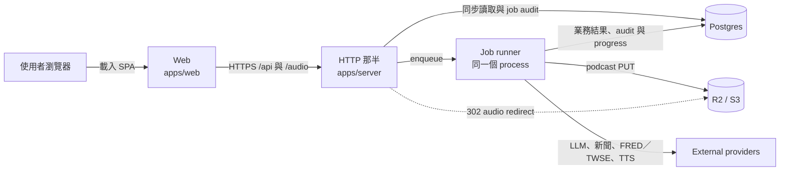

# 系統概覽

> 本頁用五分鐘建立 Cascade 的產品與 runtime 心智模型。Workspace 邊界與完整 surface 見 [模組地圖](module-map.md)，詳細執行分支留在各專頁。

## 產品與有效入口

Cascade（連動）是本 repo 的主產品：把每日總經新聞整理成有引用依據的連動分析，並可延伸產生 podcast 文稿與音檔。瀏覽器目前有五個有效入口：

| Route | 用途 |
|---|---|
| `/` | 最新 Daily Brief；可切換閱讀與 podcast 模式 |
| `/d/:date` | 指定日期的 Daily Brief |
| `/brief` | 相容舊網址，redirect 到 `/` |
| `/brief/news/:id` | 單則已收錄新聞的連動分析 |
| `/brief/analyze` | 貼入新聞內容、啟動 ad-hoc 分析並輪詢結果 |

## Repository 結構

Monorepo 有兩個可部署 app、四個共用 package：

| Workspace | 職責 |
|---|---|
| `apps/web` | Vue 3 SPA；路由、Pinia state、Daily Brief／新聞／podcast UI |
| `apps/server` | 單一 process 兼兩件事：Hono HTTP 邊界（讀 Postgres、驗證 request、enqueue、job polling、audio redirect／stream）與 job runner（新聞與市場資料更新、multi-agent 分析、brief、podcast 與 prompt research）|
| `packages/shared` | 前後端共用 Zod schema、型別與 compliance helper |
| `packages/db` | Drizzle schema、Postgres repos、migration 與 podcast storage abstraction |
| `packages/jobs` | 八種 job 的 payload schema、in-process runner、dedupe 與 audit lifecycle |
| `packages/prompt-research` | Prompt 蒸餾、合併與 candidate 編譯 runtime；production promotion 仍由人工把關 |

`docs/` 保存現行架構、功能、維運與 change notes；歷史設計不等於 active runtime。

## Runtime Services

- 部署單位有兩個：`server`（HTTP 與 job 同一個 process）與 `web`；Web 不直接連資料庫或第三方 provider。
- HTTP 那半接請求、同步讀資料與排工作，但不執行 LLM 或 scrape。
- job 那半不開 public HTTP；它從同 process 的 runner 取 job，呼叫外部 provider，再把可查詢結果寫回 Postgres 或 R2。
- Postgres 保存業務結果、`background_jobs` audit 與執行中的 progress；等待中與執行中的 job 只活在 server process 的記憶體裡，重啟即歸零（開機時 `failAllInflight()` 清帳）；R2 保存 production podcast 音檔。
- 經濟行事曆不是 external provider；market-data context 直接載入 repo-local [`apps/server/data/econ-calendar.json`](../../apps/server/data/econ-calendar.json)。

## 五分鐘資料流

1. **同步報告讀取**：`/` 或 `/d/:date` 由 Web 呼叫 API；`daily-brief` job 早已把報告與 citations 存在 `daily_briefs.briefJson`。API 讀取既有 brief／citation／podcast metadata，依 `selectedNewsIds` 載入 `news_items` 後組成 response，不在讀取時產生 citation；可選日期由另一個 `/api/brief/dates` request 取得。
2. **非同步分析**：Web 對 `/api/brief/analyze` 送出內容；server 建立 audit 並 enqueue `analyze`，Web 透過 `/api/jobs/:jobId` 輪詢，完成後再讀 analysis result。
3. **每日產製**：排程、internal endpoint 或 CLI 觸發 Daily Brief；handler 先選稿與載入 storylines／市場脈絡，再執行 multi-agent pipeline、保存報告，並 best-effort 串接 podcast 文稿與 TTS job。
4. **音訊交付**：podcast-tts job 在 production 把 MP3 寫進 R2，Postgres 只存 object path；Web 取得 audio URL 後，HTTP 端回 302 到 R2 public URL。Local storage 僅適合開發環境或確定只有單一容器的情境。

Retry、idempotency、partial success、降級與每條 job branch 的精確行為，統一見 [Runtime Flows](runtime-flows.md)。Agent 順序、prompt、model 與 structured-output gate 見 [Agents 與 Prompts](agents-and-prompts.md)。

## 系統設計原則

- **清楚分離同步與長任務**：route handler 保持薄；LLM、scrape、TTS 與資料刷新交給 job runner 執行。
- **資料契約優先**：跨 app 的業務形狀由 Zod schema 驗證；LLM output 依類型再經 normalizer、citation allowlist 與 compliance gate。
- **單向依賴**：apps 不能互相 import，packages 不能依賴 apps；共用能力下沉到明確 package。
- **持久資料各司其職**：Postgres 放可查詢資料、audit 與 progress，R2 放大型音檔；佇列只活在 process 記憶體裡，任何需要跨重啟存活的東西都不放那；也不把暫態 filesystem 當跨服務 storage。
- **安全與法遵在 backend 收斂**：Web 不持有 provider key；引用與投信投顧用語限制由 backend prompt、schema 與程式檢查共同守住，詳見 [Compliance 與 Citations](compliance-and-citations.md)。
- **文件以 active caller 為準**：歷史 spec 用來解釋決策；entrypoint、route mount、job registry、schema 與 production caller 才是現況來源。

## 深入閱讀

- [模組地圖](module-map.md)：workspace ownership、public surface、依賴方向與 job registry。
- [Runtime Flows](runtime-flows.md)：同步讀取、非同步 lifecycle、每日產製、storage、retry 與降級。
- [Agents 與 Prompts](agents-and-prompts.md)：runtime agents、prompt、provider、structured output 與 prompt research。
- [Compliance 與 Citations](compliance-and-citations.md)：禁用語、citation allowlist、schema 與失敗語意。
